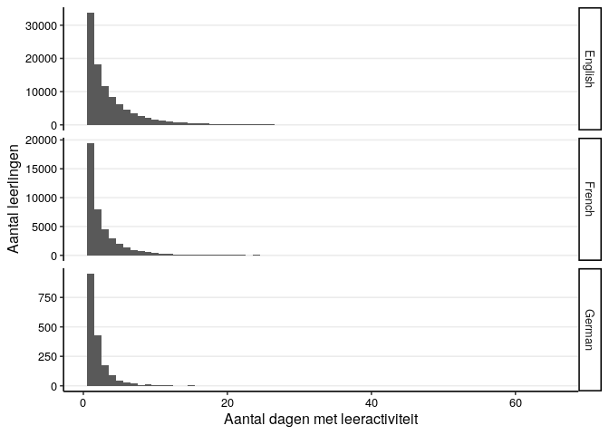
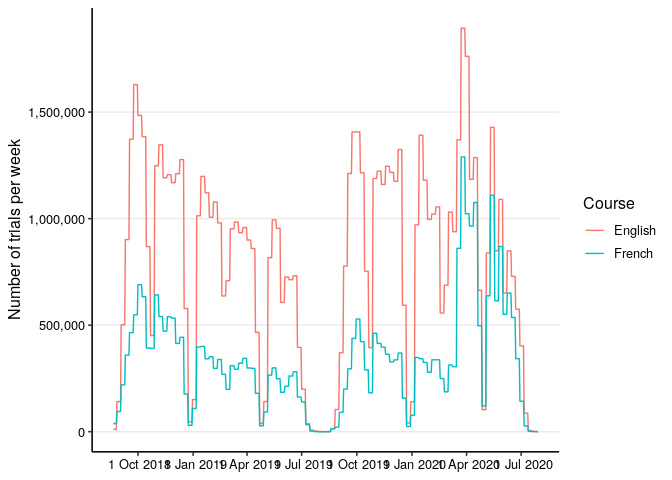
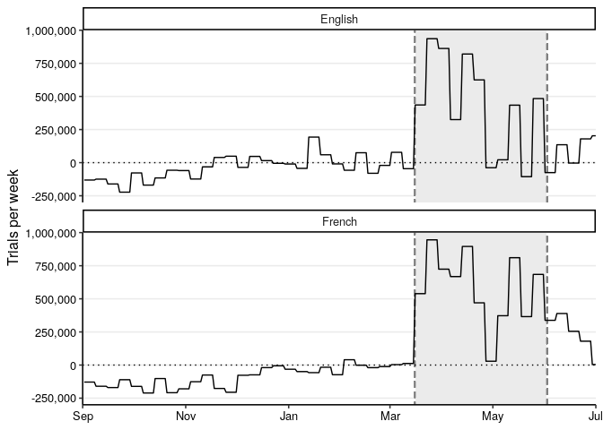
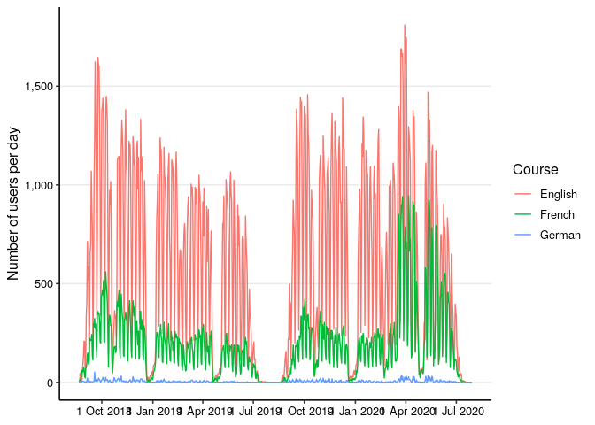
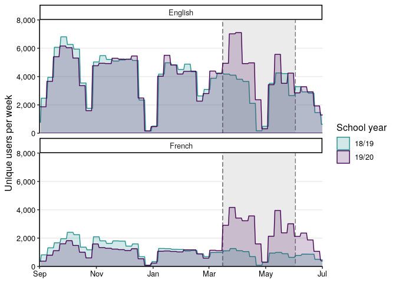

SlimStampen Usage During Lockdown
================
Maarten van der Velde
Last updated: 2021-02-17

# Setup

``` r
library(data.table)
library(DBI)
library(ggplot2)
library(cowplot)
```

    ## 
    ## Attaching package: 'cowplot'

    ## The following object is masked from 'package:ggplot2':
    ## 
    ##     ggsave

``` r
library(grid)

Sys.setlocale("LC_TIME", "en_US.UTF-8") # Print English date format
```

    ## [1] "en_US.UTF-8"

``` r
# Sys.setlocale("LC_TIME", "nl_NL.UTF-8") # Print Dutch date format

number_format <- scales::number_format(big.mark = ",", decimal.mark = ".") # Print English number format
# number_format <- scales::number_format(big.mark = ".", decimal.mark = ",") # Print Dutch number format

theme_paper <- theme_classic(base_size = 12) + 
  theme(axis.text = element_text(colour = "black"),
        panel.grid.major.y = element_line(colour = "grey92"))
```

School closure and opening dates

Sources: -
<https://www.rijksoverheid.nl/actueel/nieuws/2020/03/15/aanvullende-maatregelen-onderwijs-horeca-sport>
-
<https://www.rijksoverheid.nl/actueel/nieuws/2020/05/19/onderwijs-gaat-stap-voor-stap-open>

``` r
date_schools_closed <- as.POSIXct("2020-03-16")
date_schools_opened <- as.POSIXct("2020-06-02")
```

Handle database connections

``` r
db_connect <- function() {
  db <- dbConnect(RSQLite::SQLite(), file.path("..", "data", "noordhoff.sqlite"))
  return(db)
}

db_disconnect <- function(db) {
  dbDisconnect(db)
}
```

# Data

The database contains all SlimStampen data collected via Noordhoff’s
platform in three courses: *Stepping Stones* (English), *Grandes Lignes*
(French), and *Neue Kontakte* (German).

Trial-level response data are stored in the `responses` table. Book
information, such as the course year, book title, and chapter, are
stored in the `book_info`
table.

## `responses`

| Column                 | Type | Explanation                                   |
| ---------------------- | ---- | --------------------------------------------- |
| date                   | int  | UNIX time stamp \[s\]                         |
| user\_id               | chr  | unique user identifier                        |
| method                 | chr  | course                                        |
| start\_time            | int  | elapsed time since session start \[ms\]       |
| rt                     | int  | response time \[ms\]                          |
| duration               | int  | trial duration \[ms\]                         |
| fact\_id               | int  | unique fact identifier (within chapter)       |
| correct                | int  | response accuracy                             |
| answer                 | chr  | user’s response                               |
| choices                | int  | number of answer choices (1 == open response) |
| backspace\_used        | dbl  | user pressed backspace during trial           |
| backspace\_used\_first | dbl  | user erased first character of response       |
| study                  | int  | trial was a study trial                       |
| answer\_language       | chr  | language of the answer                        |
| subsession             | int  | identifies part within learning session       |
| book\_info\_id         | chr  | unique identifier of book information         |

## `book_info`

| Column         | Type | Explanation                             |
| -------------- | ---- | --------------------------------------- |
| book\_info\_id | chr  | unique identifier of book information   |
| method\_group  | chr  | year and edition                        |
| book\_title    | chr  | book title (incl. year, level, edition) |
| book\_type     | chr  | type of book                            |
| chapter        | chr  | chapter number and title                |

Preview first 10 rows

``` r
db <- db_connect()
responses_top <- dbGetQuery(db, "SELECT * FROM responses LIMIT 10")
responses_top
```

    ##          date                              user_id          method
    ## 1  1539683361 08a841d7-e150-4c57-8d3b-8a174ce8c06a Stepping Stones
    ## 2  1539683361 08a841d7-e150-4c57-8d3b-8a174ce8c06a Stepping Stones
    ## 3  1539683361 08a841d7-e150-4c57-8d3b-8a174ce8c06a Stepping Stones
    ## 4  1539683361 08a841d7-e150-4c57-8d3b-8a174ce8c06a Stepping Stones
    ## 5  1539683361 08a841d7-e150-4c57-8d3b-8a174ce8c06a Stepping Stones
    ## 6  1539683361 08a841d7-e150-4c57-8d3b-8a174ce8c06a Stepping Stones
    ## 7  1539683361 08a841d7-e150-4c57-8d3b-8a174ce8c06a Stepping Stones
    ## 8  1539683361 08a841d7-e150-4c57-8d3b-8a174ce8c06a Stepping Stones
    ## 9  1539683361 08a841d7-e150-4c57-8d3b-8a174ce8c06a Stepping Stones
    ## 10 1539683361 08a841d7-e150-4c57-8d3b-8a174ce8c06a Stepping Stones
    ##    start_time   rt duration fact_id correct               answer choices
    ## 1         304 2412     2413       5       1                 fout       4
    ## 2        3783  893      893       5       1                 fout       4
    ## 3        5749 1830     1830       6       1           bergachtig       4
    ## 4        8665 1625     1625       6       1           bergachtig       4
    ## 5       11364 1115     1116       2       1                 rand       4
    ## 6       13595 2697     2697       4       1 vergeven en vergeten       4
    ## 7       17379 1475     1475       2       1                 rand       4
    ## 8       19929 2749     2749       4       1 vergeven en vergeten       4
    ## 9       23825 2851     2851       1       1          je gedragen       4
    ## 10      27927 1940     1940       8       1           bouwvallig       4
    ##    backspace_used backspace_used_first study answer_language subsession
    ## 1              NA                   NA     0              NL          1
    ## 2              NA                   NA     0              NL          1
    ## 3              NA                   NA     0              NL          1
    ## 4              NA                   NA     0              NL          1
    ## 5              NA                   NA     0              NL          1
    ## 6              NA                   NA     0              NL          1
    ## 7              NA                   NA     0              NL          1
    ## 8              NA                   NA     0              NL          1
    ## 9              NA                   NA     0              NL          1
    ## 10             NA                   NA     0              NL          1
    ##                        book_info_id
    ## 1  2562c0861746d69665bc006db57d61d2
    ## 2  2562c0861746d69665bc006db57d61d2
    ## 3  2562c0861746d69665bc006db57d61d2
    ## 4  2562c0861746d69665bc006db57d61d2
    ## 5  2562c0861746d69665bc006db57d61d2
    ## 6  2562c0861746d69665bc006db57d61d2
    ## 7  2562c0861746d69665bc006db57d61d2
    ## 8  2562c0861746d69665bc006db57d61d2
    ## 9  2562c0861746d69665bc006db57d61d2
    ## 10 2562c0861746d69665bc006db57d61d2

``` r
book_info_top <- dbGetQuery(db, "SELECT * FROM book_info LIMIT 10")
book_info_top
```

    ##                        book_info_id        method_group
    ## 1  2562c0861746d69665bc006db57d61d2 Leerjaar 3 (5e Ed.)
    ## 2  2562c0861746d69665bc006db57d61d2 Leerjaar 3 (5e Ed.)
    ## 3  2562c0861746d69665bc006db57d61d2 Leerjaar 3 (5e Ed.)
    ## 4  669e672f2c250b5b93c2b7cbe13f89ee Leerjaar 1 (5e Ed.)
    ## 5  669e672f2c250b5b93c2b7cbe13f89ee Leerjaar 1 (5e Ed.)
    ## 6  fa534b16f415fa69e378fd112acfa6e0 Leerjaar 1 (5e Ed.)
    ## 7  fa534b16f415fa69e378fd112acfa6e0 Leerjaar 1 (5e Ed.)
    ## 8  d144843118b70c545e1c85c91634a1c6 Leerjaar 1 (5e Ed.)
    ## 9  d144843118b70c545e1c85c91634a1c6 Leerjaar 1 (5e Ed.)
    ## 10 d144843118b70c545e1c85c91634a1c6 Leerjaar 1 (5e Ed.)
    ##                book_title          book_type              chapter
    ## 1      3 vmbo gt (5e Ed.)               <NA>                 <NA>
    ## 2      3 vmbo gt (5e Ed.) Activiteitenboek A       2 To the limit
    ## 3      3 vmbo gt (5e Ed.)          Hoofdboek      2 To the limit!
    ## 4  1 vmbo b/lwoo (5e Ed.)               <NA>                 <NA>
    ## 5  1 vmbo b/lwoo (5e Ed.)          Hoofdboek 1 Family and friends
    ## 6  1 vmbo b/lwoo (5e Ed.)               <NA>                 <NA>
    ## 7  1 vmbo b/lwoo (5e Ed.)          Hoofdboek        2 School life
    ## 8  1 vmbo b/lwoo (5e Ed.)               <NA>                 <NA>
    ## 9  1 vmbo b/lwoo (5e Ed.) Activiteitenboek A        2 School life
    ## 10 1 vmbo b/lwoo (5e Ed.)          Hoofdboek        2 School life

``` r
db_disconnect(db)
```

# Usage

Get number of trials by method, day, and user:

``` r
db <- db_connect()
counts <- dbGetQuery(db,"SELECT responses.method AS 'method',
                          DATE(responses.date + 3600, 'unixepoch') AS 'doy',
                          responses.user_id AS 'user',
                          COUNT(*) AS 'trials'
                          FROM 'responses'
                          GROUP BY responses.method,
                          DATE(responses.date  + 3600, 'unixepoch'),
                          responses.user_id
                        ")
db_disconnect(db)

setDT(counts)
```

Add a school year column (cutoff date: 1 August):

``` r
counts[, doy_posix := as.POSIXct(doy)]
counts[, school_year := ifelse(doy_posix < "2019-08-01", "18/19", "19/20")]
```

Add more sensible course
names:

``` r
counts[, course := ifelse(method == "Grandes Lignes", "French", ifelse(method == "Stepping Stones", "English", "German"))]
```

## Total number of unique users by course and school year

``` r
counts[, .(unique_users = length(unique(user))), by = .(course, school_year)]
```

    ##     course school_year unique_users
    ## 1:  French       18/19        21551
    ## 2:  French       19/20        26292
    ## 3:  German       18/19          828
    ## 4:  German       19/20         1043
    ## 5: English       18/19        58422
    ## 6: English       19/20        61962

There was some overlap between courses/school years, so we can’t simply
add these numbers.

By course:

``` r
counts[, .(unique_users = length(unique(user))), by = .(course)]
```

    ##     course unique_users
    ## 1:  French        42747
    ## 2:  German         1778
    ## 3: English       100162

By school year in the French and English
courses:

``` r
counts[course %in% c("French", "English"), .(unique_users = length(unique(user))), by = .(school_year)]
```

    ##    school_year unique_users
    ## 1:       18/19        75695
    ## 2:       19/20        83496

And total number of unique users in the French and English sample across
both
years:

``` r
counts[course %in% c("French", "English"), .(unique_users = length(unique(user)))]
```

    ##    unique_users
    ## 1:       133450

## Total number of trials by course

``` r
counts[, .(total_trials = sum(trials)), by = .(course, school_year)]
```

    ##     course school_year total_trials
    ## 1:  French       18/19     14582897
    ## 2:  French       19/20     20276843
    ## 3:  German       18/19       333047
    ## 4:  German       19/20       474833
    ## 5: English       18/19     38334387
    ## 6: English       19/20     43072404

## Number of trials by user

``` r
counts[, trials_user := sum(trials), by = .(course, user)]
ggplot(counts, aes(x = trials_user)) +
  facet_wrap(~course, ncol = 1, scales = "free_y") +
  geom_histogram(binwidth = 100) +
  labs(x = "Number of trials by user",
       y = NULL) +
  theme_paper
```

<!-- -->

## Number of unique days by user

``` r
ggplot(counts[, .(N = length(unique(doy_posix))), by = c("user", "course")], aes(x = N)) +
  facet_grid(course ~ ., scales = "free_y") +
  geom_histogram(binwidth = 1) +
  labs(x = "Aantal dagen met leeractiviteit",
       y = "Aantal leerlingen") +
  theme_paper
```

<!-- -->

## Total number of trials by day

Interpolate missing
days:

``` r
doy_posix <- seq.POSIXt(from = counts[,min(doy_posix)], to = counts[,max(doy_posix)], by = "DSTday")
course <- counts[,unique(course)]
dates <- CJ(doy_posix, course)
counts <- merge(counts, dates, by = c("doy_posix", "course"), all = TRUE)
```

Count trials by
day:

``` r
counts[, trials_total := sum(trials, na.rm = TRUE), by = .(course, doy_posix)]
```

``` r
counts_by_day <- counts[, .(trials_total = sum(trials, na.rm = TRUE)), by = .(course, doy_posix)]
```

``` r
ggplot(counts_by_day[course %in% c("English", "French"),],
       aes(x = doy_posix, y = trials_total, colour = course)) +
  geom_line() +
  scale_x_datetime(date_breaks = "3 months", date_labels = "%e %b %Y") +
  scale_y_continuous(labels = number_format) +
  labs(x = NULL,
       y = "Number of trials per day",
       colour = "Course") +
  theme_paper
```

<!-- -->

## Total number of trials by week

Use cut.Date() to bin dates by week. Each day is assigned the date of
the most recent Monday.

``` r
counts_by_day[, doy_posix_week := cut.POSIXt(doy_posix, "week")]
counts_by_day[, trials_total_week := sum(trials_total, na.rm = TRUE), by = .(course, doy_posix_week)]
```

``` r
ggplot(counts_by_day[course %in% c("English", "French"),],
            aes(x = doy_posix, y = trials_total_week, colour = course)) +
  geom_line() +
  scale_x_datetime(date_breaks = "3 months", date_labels = "%e %b %Y") +
  scale_y_continuous(labels = number_format) +
  labs(x = NULL,
       y = "Number of trials per week",
       colour = "Course") +
  theme_paper
```

<!-- -->

Overlap the two school
years:

``` r
counts_by_day[, school_year := ifelse(doy_posix < "2019-08-01", "18/19", "19/20")]
counts_by_day[school_year == "18/19", doy_posix_aligned := as.POSIXct(doy_posix + 365*24*60*60, origin = "1970-01-01")]
counts_by_day[school_year == "19/20", doy_posix_aligned := doy_posix]
```

``` r
p_trial_hist <- ggplot(counts_by_day[course %in% c("English", "French"),],
            aes(x = doy_posix_aligned, ymin = 0, ymax = trials_total_week, group = school_year, colour = school_year, fill = school_year)) +
  facet_wrap(~ course, ncol = 1) +
  geom_rect(xmin = date_schools_closed, xmax = date_schools_opened, ymin = -2e5, ymax = 2.2e6, fill = "grey92", colour = "grey50", lty = 2) +
  geom_ribbon(alpha = .2) +
  scale_x_datetime(expand = c(0, 0), 
                   breaks = as.POSIXct(c(
                     "2019-09-01 02:00:00 CET",
                     "2019-11-01 02:00:00 CET",
                     "2020-01-01 02:00:00 CET",
                     "2020-03-01 02:00:00 CET",
                     "2020-05-01 02:00:00 CET",
                     "2020-07-01 02:00:00 CET")),
                   limits = as.POSIXct(c("2019-09-01 02:00:00 CET", "2020-07-01 02:00:00 CET")),
                   date_labels = "%b") +
  scale_y_continuous(expand = c(0, 0), limits = c(0, 2e6), labels = number_format) +
  scale_colour_viridis_d(end = .5, direction = -1, na.translate = FALSE) +
  scale_fill_viridis_d(end = .5, direction = -1, na.translate = FALSE) +
  labs(x = NULL,
       y = "Trials per week",
       colour = "School year",
       fill = "School year") +
  theme_paper

p_trial_hist
```

<!-- -->

``` r
ggsave("../output/trial_hist.pdf", width = 5, height = 3)
ggsave("../output/trial_hist.png", width = 5, height = 3)
```

Make a line-plot version of the
histogram.

``` r
p_trial_hist_line <- ggplot(counts_by_day[course %in% c("English", "French")],
            aes(x = doy_posix_aligned, y = trials_total_week, group = school_year, colour = school_year, fill = school_year)) +
  facet_wrap(~ course, ncol = 1) +
  geom_rect(xmin = date_schools_closed, xmax = date_schools_opened, ymin = -2e5, ymax = 2.2e6, fill = "grey92", colour = "grey50", lty = 2) +
  geom_line() +
  scale_x_datetime(expand = c(0, 0), 
                   breaks = as.POSIXct(c(
                     "2019-09-01 02:00:00 CET",
                     "2019-11-01 02:00:00 CET",
                     "2020-01-01 02:00:00 CET",
                     "2020-03-01 02:00:00 CET",
                     "2020-05-01 02:00:00 CET",
                     "2020-07-01 02:00:00 CET")),
                   limits = as.POSIXct(c("2019-09-01 02:00:00 CET", "2020-07-01 02:00:00 CET")),
                   date_labels = "%b") +
  scale_y_continuous(expand = c(0, 0), limits = c(0, 2e6), labels = number_format) +
  scale_colour_viridis_d(end = .5, direction = -1, na.translate = FALSE) +
  scale_fill_viridis_d(end = .5, direction = -1, na.translate = FALSE) +
  labs(x = NULL,
       y = "Trials per week",
       colour = "School year",
       fill = "School year") +
  theme_paper

p_trial_hist_line
```

    ## Warning: Removed 101 row(s) containing missing values (geom_path).

<!-- -->

``` r
ggsave("../output/trial_hist_line.pdf", width = 5, height = 3)
```

    ## Warning: Removed 101 row(s) containing missing values (geom_path).

``` r
ggsave("../output/trial_hist_line.png", width = 5, height = 3)
```

    ## Warning: Removed 101 row(s) containing missing values (geom_path).

Also make a difference
plot.

``` r
# In order for the Mondays to align, move the 18/19 data forward by 1 year - 1 day.
counts_by_day[school_year == "18/19", doy_posix_aligned := as.POSIXct(doy_posix + 364*24*60*60, origin = "1970-01-01")]
counts_by_day[school_year == "19/20", doy_posix_aligned := doy_posix]
```

``` r
counts_by_day[, year_diff := trials_total_week[2] - trials_total_week[1], by = .(course, doy_posix_aligned)]

ggplot(counts_by_day[course %in% c("English", "French")],
            aes(x = doy_posix_aligned, y = year_diff)) +
  facet_wrap(~ course, ncol = 1) +
  geom_rect(xmin = date_schools_closed, xmax = date_schools_opened, ymin = -1e6, ymax = 1.1e6, fill = "grey92", colour = "grey50", lty = 2) +
  geom_hline(yintercept = 0, lty = 3) +
  geom_line() +
  scale_x_datetime(expand = c(0, 0), 
                   breaks = as.POSIXct(c(
                     "2019-09-01 02:00:00 CET",
                     "2019-11-01 02:00:00 CET",
                     "2020-01-01 02:00:00 CET",
                     "2020-03-01 02:00:00 CET",
                     "2020-05-01 02:00:00 CET",
                     "2020-07-01 02:00:00 CET")),
                   limits = as.POSIXct(c("2019-09-01 02:00:00 CET", "2020-07-01 02:00:00 CET")),
                   date_labels = "%b") +
  scale_y_continuous(expand = c(0, 0), limits = c(-3e5, 1e6), labels = number_format) +
  labs(x = NULL,
       y = "Trials per week",
       colour = "School year",
       fill = "School year") +
  theme_paper
```

    ## Warning: Removed 101 row(s) containing missing values (geom_path).

<!-- -->

## Number of trials by user and week

``` r
counts[, doy_posix_week := cut.POSIXt(doy_posix, "week")]
counts_by_user_and_week <- counts[, .(trials_user = sum(trials, na.rm = TRUE)), by = .(course, school_year, user, doy_posix_week)]
```

Save for clustering
analysis

``` r
saveRDS(na.omit(counts_by_user_and_week[course %in% c("English", "French")]), "../data/trials_by_user_and_week.rds")
```

## Unique users by day

``` r
users_by_day <- counts[, .(unique_users = length(unique(user))), by = .(course, doy_posix)]
```

``` r
p <- ggplot(users_by_day, aes(x = doy_posix, y = unique_users, colour = course)) +
  geom_line() +
  scale_x_datetime(date_breaks = "3 months", date_labels = "%e %b %Y") +
  scale_y_continuous(labels = number_format) +
  labs(x = NULL,
       y = "Number of users per day",
       colour = "Course") +
  theme_paper

p
```

<!-- -->

## Unique users by week

Use cut.Date() to bin dates by week. Each day is assigned the date of
the most recent
Monday.

``` r
users_by_day[, doy_posix_week := cut.POSIXt(doy_posix, "week")]
```

``` r
users_by_week <- counts[, .(unique_users_week = length(unique(user))), by = .(course, doy_posix_week)]
users_by_week <- users_by_day[users_by_week, on = .(course, doy_posix_week)]
```

``` r
p <- ggplot(users_by_week, aes(x = doy_posix, ymin = 0, ymax = unique_users_week, group = course, colour = course, fill = course)) +
  facet_wrap(~ course, ncol = 1, scales = "free_y") +
  geom_ribbon(alpha = .2) +
  scale_x_datetime(date_breaks = "3 months", date_labels = "%e %b %Y") +
  scale_y_continuous(labels = scales::number_format(big.mark = ".", decimal.mark = ",")) +
  labs(x = NULL,
       y = "Aantal gebruikers",
       title = "Aantal verschillende gebruikers per week",
       caption = "Let op: schaal verschilt tussen de grafieken",
       colour = "Lesmethode",
       fill = "Lesmethode") +
  guides(colour = FALSE, fill = FALSE) +
  theme_paper

p
```

<!-- -->

Overlap the two school
years:

``` r
users_by_week[, school_year := ifelse(doy_posix < "2019-08-01", "18/19", "19/20")]
users_by_week[school_year == "18/19", doy_posix_aligned := as.POSIXct(doy_posix + 365*24*60*60, origin = "1970-01-01")]
users_by_week[school_year == "19/20", doy_posix_aligned := doy_posix]
```

``` r
p_user_hist <- ggplot(users_by_week[course %in% c("English", "French"),],
            aes(x = doy_posix_aligned, ymin = 0, ymax = unique_users_week, group = school_year, colour = school_year, fill = school_year)) +
  facet_wrap(~ course, ncol = 1) +
  geom_rect(xmin = date_schools_closed, xmax = date_schools_opened, ymin = -800, ymax = 8800, fill = "grey92", colour = "grey50", lty = 2) +
  geom_ribbon(alpha = .2) +
  scale_x_datetime(expand = c(0, 0), 
                   breaks = as.POSIXct(c(
                     "2019-09-01 02:00:00 CET",
                     "2019-11-01 02:00:00 CET",
                     "2020-01-01 02:00:00 CET",
                     "2020-03-01 02:00:00 CET",
                     "2020-05-01 02:00:00 CET",
                     "2020-07-01 02:00:00 CET")),
                   limits = as.POSIXct(c("2019-09-01 02:00:00 CET", "2020-07-01 02:00:00 CET")),
                   date_labels = "%b") +
  scale_y_continuous(expand = c(0, 0), limits = c(0, 8000), labels = number_format) +
  scale_colour_viridis_d(end = .5, direction = -1, na.translate = FALSE) +
  scale_fill_viridis_d(end = .5, direction = -1, na.translate = FALSE) +
  labs(x = NULL,
       y = "Unique users per week",
       colour = "School year",
       fill = "School year") +
  theme_paper

p_user_hist
```

<!-- -->

``` r
ggsave("../output/user_hist.pdf", width = 5, height = 3)
ggsave("../output/user_hist.png", width = 5, height = 3)
```

Make a combined plot of trial and user counts for in the paper:

``` r
p_legend <- get_legend(p_trial_hist)

p_trial_hist <- p_trial_hist +
  guides(colour = FALSE, fill = FALSE)

p_user_hist <- p_user_hist +
  guides(colour = FALSE, fill = FALSE)
```

``` r
plot_grid(plot_grid(p_trial_hist, p_user_hist,
          labels = c("A", "B"),
          align = "v", axis = "tblr"),
          p_legend,
          rel_widths = c(1, .2))
```

<!-- -->

``` r
ggsave("../output/combi_hist.pdf", width = 9, height = 3)
ggsave("../output/combi_hist.png", width = 9, height = 3)
```

## Activity during the week

Get number of trials by method, day, hour, and user:

``` r
db <- db_connect()
counts_by_hour <- dbGetQuery(db,"SELECT responses.method AS 'method',
                          DATE(responses.date + 3600, 'unixepoch') AS 'doy',
                          STRFTIME('%H', responses.date + 3600, 'unixepoch') AS 'hour',
                          responses.user_id AS 'user',
                          COUNT(*) AS 'trials'
                          FROM 'responses'
                          GROUP BY responses.method,
                          DATE(responses.date + 3600, 'unixepoch'),
                          STRFTIME('%H', responses.date + 3600, 'unixepoch'),
                          responses.user_id
                        ")
db_disconnect(db)

setDT(counts_by_hour)
```

Interpolate missing days and hours:

``` r
counts_by_hour[, doy_posix := as.POSIXct(doy)]
counts_by_hour[, hour := as.numeric(hour)]
doy_posix <- seq.POSIXt(from = counts_by_hour[,min(doy_posix)], to = counts_by_hour[,max(doy_posix)], by = "DSTday")
method <- counts_by_hour[,unique(method)]
hour <- 0:23
dates_and_hours <- CJ(doy_posix, hour, method)
counts_by_hour <- merge(counts_by_hour, dates_and_hours, by = c("doy_posix", "hour", "method"), all = TRUE)
```

Add day of the week:

``` r
counts_by_hour[, weekday := weekdays(doy_posix)]
```

Distinguish between school
years:

``` r
counts_by_hour[, school_year := ifelse(doy_posix < "2019-08-01", "18/19", "19/20")]
```

Add
quarter:

``` r
counts_by_hour[, quarter := paste0(year(doy_posix), "Q", quarter(doy_posix))]
```

Add exact school closure period in both school
years:

``` r
counts_by_hour[school_year == "18/19", doy_posix_aligned := as.POSIXct(doy_posix + 365*24*60*60, origin = "1970-01-01")]
counts_by_hour[school_year == "19/20", doy_posix_aligned := doy_posix]

counts_by_hour[, schools_closed := doy_posix_aligned >= date_schools_closed & doy_posix_aligned < date_schools_opened]
```

Add more sensible course
names:

``` r
counts_by_hour[, course := ifelse(method == "Grandes Lignes", "French", ifelse(method == "Stepping Stones", "English", "German"))]
```

Sum trials by school year, weekday and
hour:

``` r
counts_by_hour[, trials_schoolyear := sum(trials, na.rm = TRUE), by = .(course, school_year, weekday, hour)]
```

Also sum trials by quarter, weekday and
hour:

``` r
counts_by_hour[, trials_quarter := sum(trials, na.rm = TRUE), by = .(course, quarter, weekday, hour)]
```

And sum trials within the closure period by weekday and
hour:

``` r
counts_by_hour[schools_closed == TRUE, trials_closed := sum(trials, na.rm = TRUE), by = .(course, school_year, weekday, hour)]
```

``` r
trials_by_wday_hour <- unique(counts_by_hour, by = c("course", "school_year", "quarter", "schools_closed", "weekday", "hour"))

trials_by_wday_hour[, trials_normalised_schoolyear := trials_schoolyear / sum(trials_schoolyear), by = .(course)]
trials_by_wday_hour[, trials_normalised_quarter := trials_quarter / sum(trials_quarter), by = .(course)]

trials_by_wday_hour[, weekday := ordered(weekday, levels = c("Monday", "Tuesday", "Wednesday", "Thursday", "Friday", "Saturday", "Sunday"))]
# trials_by_wday_hour[, weekday := ordered(weekday, levels = c("maandag", "dinsdag", "woensdag", "donderdag", "vrijdag", "zaterdag", "zondag"))]
```

Plot heatmap for the whole school year:

``` r
ggplot(trials_by_wday_hour[course %in% c("English", "French")],
       aes(x = hour, y = reorder(weekday, dplyr::desc(weekday)), fill = trials_normalised_schoolyear)) + 
  facet_grid(school_year ~ course) +
  geom_tile(colour = "white", size = 0.25) +
  labs(x = "Time of day (hour)",
       y = NULL) +
  scale_x_continuous(expand = c(0,0), breaks = seq(0, 24, 3)) +
  scale_y_discrete(expand = c(0,0)) + 
  scale_fill_viridis_c(option = "A", direction = -1) +
  coord_fixed() +
  guides(fill = FALSE) +
  theme_paper
```

<!-- -->

Plot heatmap per
quarter:

``` r
ggplot(trials_by_wday_hour, aes(x = hour, y = reorder(weekday, dplyr::desc(weekday)), fill = trials_normalised_quarter)) + 
  facet_grid(quarter ~ method) +
  geom_tile(colour = "white", size = 0.25) +
  labs(x = NULL,
       y = NULL,
       title = "Activiteit per uur gedurende de week",
       caption = "Aantal trials per weekdag en uur in elk kwartaal, genormaliseerd per methode.") +
  scale_x_continuous(expand = c(0,0), breaks = seq(0, 24, 3)) +
  scale_y_discrete(expand = c(0,0)) + 
  scale_fill_viridis_c(option = "A", direction = -1) +
  coord_fixed() +
  guides(fill = FALSE) +
  theme_bw(base_size = 16)
```

<!-- -->

Plot heatmap for the period in which schools were
closed:

``` r
trials_closed <- unique(trials_by_wday_hour[schools_closed == TRUE, .(course, school_year, weekday, hour, trials_closed)])

trials_closed[, trials_normalised_closed := trials_closed / sum(trials_closed), by = .(course, school_year)]
```

``` r
trials_closed_diff <- trials_closed[, .(school_year = "Change",
                                        trials_closed = trials_closed[school_year == "19/20"] - trials_closed[school_year == "18/19"],
                                        trials_normalised_closed = trials_normalised_closed[school_year == "19/20"] - trials_normalised_closed[school_year == "18/19"]), by = .(course, weekday, hour)]
```

``` r
p_heatmap <- ggplot(trials_closed[course %in% c("English", "French"),],
       aes(x = hour, y = reorder(weekday, dplyr::desc(weekday)), fill = trials_normalised_closed)) + 
  facet_grid(school_year ~ course) +
  geom_tile(colour = "white", size = 0.25) +
  labs(x = "Time of day (hour)",
       y = NULL,
       fill = NULL) +
  scale_x_continuous(expand = c(0,0), breaks = seq(0, 24, 3)) +
  scale_y_discrete(expand = c(0,0)) + 
  scale_fill_viridis_c(option = "A", direction = -1) +
  coord_fixed() +
  theme_paper


p_heatmap
```

<!-- -->

Make a plot of the difference between the two school years during the
school closure
period:

``` r
p_heatmap_diff <- ggplot(trials_closed_diff[course %in% c("English", "French"),],
       aes(x = hour, y = reorder(weekday, dplyr::desc(weekday)), fill = trials_normalised_closed)) + 
  facet_grid(school_year ~ course) +
  geom_tile(colour = "white", size = 0.25) +
  labs(x = "Time of day (hour)",
       y = NULL,
       fill = NULL) +
  scale_x_continuous(expand = c(0,0), breaks = seq(0, 24, 3)) +
  scale_y_discrete(expand = c(0,0)) + 
  scale_fill_distiller(type = "div", palette = "RdBu", direction = -1, limits = c(-1, 1) * max(abs(trials_closed_diff[course %in% c("English", "French"),]$trials_normalised_closed))) +
  coord_fixed() +
  theme_paper

p_heatmap_diff
```

<!-- -->

Make a combined plot for in the paper:

``` r
p_heatmap_legend <- get_legend(p_heatmap)
p_heatmap_diff_legend <- get_legend(p_heatmap_diff)

p_heatmap <- p_heatmap + guides(fill = FALSE)
p_heatmap_diff <- p_heatmap_diff + guides(fill = FALSE)
```

``` r
plot_grid(
  plot_grid(p_heatmap, p_heatmap_diff,
          ncol = 1,
          labels = c("A", "B"),
          rel_heights = c(1, .655)
          ),
  plot_grid(p_heatmap_legend, p_heatmap_diff_legend,
            ncol = 1,
            align = "vh", axis = "lrtb"),
  ncol = 2,
  rel_widths = c(1, .15))
```

<!-- -->

``` r
ggsave("../output/combi_heatmap.pdf", width = 9, height = 4.5)
ggsave("../output/combi_heatmap.png", width = 9, height = 4.5)
```

## Activity stratified by year and level

``` r
db <- db_connect()
counts_strat <- dbGetQuery(db,"SELECT responses.method AS 'method',
                          responses.book_info_id as 'book_info_id',
                          DATE(responses.date + 3600, 'unixepoch') AS 'doy',
                          responses.user_id AS 'user',
                          COUNT(*) AS 'trials'
                          FROM 'responses'
                          GROUP BY responses.method, responses.book_info_id,
                          DATE(responses.date + 3600, 'unixepoch'),
                          responses.user_id
                        ")
db_disconnect(db)

setDT(counts_strat)
```

``` r
db <- db_connect()
book_info <- dbGetQuery(db, "SELECT * FROM 'book_info'")
db_disconnect(db)

setDT(book_info)
```

Add book
information:

``` r
counts_strat[book_info, on = "book_info_id", c("book_title", "method_group") := .(i.book_title, i.method_group)]
```

Add a school year column (cutoff date: 1 August):

``` r
counts_strat[, doy_posix := as.POSIXct(doy)]
counts_strat[, school_year := ifelse(doy_posix < "2019-08-01", "18/19", "19/20")]
```

Add sensible course
names:

``` r
counts_strat[, course := ifelse(method == "Grandes Lignes", "French", ifelse(method == "Stepping Stones", "English", "German"))]
```

Count trials by
day:

``` r
counts_strat_by_day <- counts_strat[, .(trials_total = sum(trials, na.rm = TRUE)), by = .(school_year, course, method_group, book_title, doy_posix)]
setorder(counts_strat_by_day, school_year, course, method_group, book_title, doy_posix)
```

Simplify level names:

``` r
# Keep all distinctions
counts_strat_by_day[, book_title_simple := stringr::str_sub(book_title, 3, -10)]
counts_strat_by_day[, book_title_simple := factor(book_title_simple, levels = c("vmbo b/lwoo", "vmbo b", "vmbo bk", "vmbo k", "vmbo kgt", "vmbo-gt", "vmbo gt", "vmbo-gt/havo", "vmbo (t)hv", "havo", "havo vwo", "vwo"))]

# Simplify to three levels
counts_strat_by_day[, level := dplyr::case_when(
  grepl( "hv", book_title) ~ "General secondary\n(havo)",
  grepl("vmbo", book_title) ~ "Pre-vocational\n(vmbo)",
  grepl("havo", book_title) ~ "General secondary\n(havo)",
  grepl("vwo", book_title) ~ "Pre-university\n(vwo)",
  TRUE ~ "Other")]
counts_strat_by_day[, level := factor(level, levels = c("Other", "Pre-vocational\n(vmbo)", "General secondary\n(havo)", "Pre-university\n(vwo)"))]
```

Simplify year names:

``` r
counts_strat_by_day[, year := dplyr::case_when(
  method_group == "Leerjaar 1 (5e Ed.)" ~ "Year 1",
  method_group == "Leerjaar 2 (5e Ed.)" ~ "Year 2",
  method_group == "Leerjaar 3 (5e Ed.)" ~ "Year 3",
  method_group == "Leerjaar 3/4 (5e Ed.)" ~ "Year 3/4",
  method_group == "Leerjaar 4 (5e Ed.)" ~ "Year 4",
  method_group == "Tweede Fase (6e Ed.)" ~ "Tweede Fase",
  TRUE ~ "Other")]
```

Align school
years:

``` r
counts_strat_by_day[school_year == "18/19", doy_posix_aligned := as.POSIXct(doy_posix + 365*24*60*60, origin = "1970-01-01")]
counts_strat_by_day[school_year == "19/20", doy_posix_aligned := doy_posix]
```

Use cut.Date() to bin dates by week. Each day is assigned the date of
the most recent
Monday.

``` r
counts_strat_by_day[, doy_posix_aligned_week := cut.POSIXt(doy_posix_aligned, "week")]
counts_strat_by_day[, trials_total_week := sum(trials_total, na.rm = TRUE), by = .(school_year, course, method_group, book_title_simple, doy_posix_aligned_week)]

counts_strat_by_day[, trials_total_week_level := sum(trials_total), by = .(school_year, course, method_group, level, doy_posix_aligned_week)]
```

Summarise increase during
lockdown:

``` r
counts_strat_increase <- counts_strat_by_day[between(doy_posix_aligned, date_schools_closed, date_schools_opened), .(trials_lockdown = sum(trials_total)), by = .(course, book_title_simple, method_group, year, school_year)]
counts_strat_increase[, increase := trials_lockdown[2]/trials_lockdown[1], by = .(course, book_title_simple, method_group, year)]
counts_strat_increase[, increase_pct := paste0("Change:\n", scales::percent(increase, accuracy = 2))]

counts_strat_increase_level <- counts_strat_by_day[between(doy_posix_aligned, date_schools_closed, date_schools_opened), .(trials_lockdown = sum(trials_total)), by = .(course, level, method_group, year, school_year)]
counts_strat_increase_level[, increase := trials_lockdown[2]/trials_lockdown[1], by = .(course, level, method_group, year)]
counts_strat_increase_level[, increase_pct := paste0("Change:\n", scales::percent(increase, accuracy = 2))]
```

### French

``` r
ggplot(counts_strat_by_day[course == "French"], 
       aes(group = school_year, colour = school_year, fill = school_year)) +
  facet_grid(book_title_simple ~ method_group) +
  geom_rect(xmin = date_schools_closed, xmax = date_schools_opened, ymin = -2e5, ymax = 2.2e6, fill = "grey92", colour = "grey50", lty = 2) +
  geom_ribbon(aes(x = doy_posix_aligned, ymin = 0, ymax = trials_total_week, ), alpha = .2) +
  geom_text(data = counts_strat_increase[course == "French" & school_year == "19/20"], 
            aes(label = increase_pct),
            x = as.POSIXct((as.numeric(date_schools_closed) + as.numeric(date_schools_opened))/2, origin = "1970-01-01"),
            y = 3.6e5,
            colour = "black",
            vjust = 1,
            show.legend = FALSE) +
  scale_x_datetime(expand = c(0, 0), 
                   breaks = as.POSIXct(c(
                     "2019-09-01 02:00:00 CET",
                     "2019-11-01 02:00:00 CET",
                     "2020-01-01 02:00:00 CET",
                     "2020-03-01 02:00:00 CET",
                     "2020-05-01 02:00:00 CET",
                     "2020-07-01 02:00:00 CET")),
                   limits = as.POSIXct(c("2019-09-01 02:00:00 CET", "2020-07-01 02:00:00 CET")),
                   date_labels = "%b") +
  scale_y_continuous(expand = c(0, 0), limits = c(0, 3.75e5), labels = number_format) +
  scale_colour_viridis_d(end = .5, direction = -1, na.translate = FALSE) +
  scale_fill_viridis_d(end = .5, direction = -1, na.translate = FALSE) +
  labs(x = NULL,
       y = "Trials per week",
       colour = "School year",
       fill = "School year",
       title = "French") +
  theme_paper
```

<!-- -->

``` r
ggsave("../output/trial_hist_french.pdf", width = 14, height = 10)
ggsave("../output/trial_hist_french.png", width = 14, height = 10)
```

Streamlined version for in the paper:

``` r
ggplot(counts_strat_by_day[course == "French"], 
       aes(group = school_year, colour = school_year, fill = school_year)) +
  facet_grid(level ~ year) +
  geom_rect(xmin = date_schools_closed, xmax = date_schools_opened, ymin = -2e5, ymax = 2.2e6, fill = "grey92", colour = "grey50", lty = 2) +
  geom_ribbon(aes(x = doy_posix_aligned, ymin = 0, ymax = trials_total_week_level, ), alpha = .2) +
  geom_text(data = counts_strat_increase_level[course == "French" & school_year == "19/20"], 
            aes(label = increase_pct),
            x = as.POSIXct((as.numeric(date_schools_closed) + as.numeric(date_schools_opened))/2, origin = "1970-01-01"),
            y = 3.6e5,
            colour = "black",
            vjust = 1,
            size = rel(2.75),
            show.legend = FALSE) +
  scale_x_datetime(expand = c(0, 0), 
                   breaks = as.POSIXct(c(
                     "2019-10-01 02:00:00 CET",
                     "2019-12-01 02:00:00 CET",
                     "2020-02-01 02:00:00 CET",
                     "2020-04-01 02:00:00 CET",
                     "2020-06-01 02:00:00 CET")),
                   limits = as.POSIXct(c("2019-09-01 02:00:00 CET", "2020-07-01 02:00:00 CET")),
                   date_labels = "%b") +
  scale_y_continuous(expand = c(0, 0), limits = c(0, 3.75e5), labels = number_format) +
  scale_colour_viridis_d(end = .5, direction = -1, na.translate = FALSE) +
  scale_fill_viridis_d(end = .5, direction = -1, na.translate = FALSE) +
  labs(x = NULL,
       y = "Trials per week",
       colour = "School year",
       fill = "School year") +
  theme_paper
```

<!-- -->

``` r
ggsave("../output/trial_hist_french_level.pdf", width = 9, height = 5)
ggsave("../output/trial_hist_french_level.png", width = 9, height = 5)
```

### English

``` r
ggplot(counts_strat_by_day[course == "English"], 
       aes(group = school_year, colour = school_year, fill = school_year)) +
  facet_grid(book_title_simple ~ method_group) +
  geom_rect(xmin = date_schools_closed, xmax = date_schools_opened, ymin = -2e5, ymax = 2.2e6, fill = "grey92", colour = "grey50", lty = 2) +
  geom_ribbon(aes(x = doy_posix_aligned, ymin = 0, ymax = trials_total_week, ), alpha = .2) +
  geom_text(data = counts_strat_increase[course == "English" & school_year == "19/20"], 
            aes(label = increase_pct),
            x = as.POSIXct((as.numeric(date_schools_closed) + as.numeric(date_schools_opened))/2, origin = "1970-01-01"),
            y = 3.6e5,
            colour = "black",
            vjust = 1,
            show.legend = FALSE) +
  scale_x_datetime(expand = c(0, 0), 
                   breaks = as.POSIXct(c(
                     "2019-09-01 02:00:00 CET",
                     "2019-11-01 02:00:00 CET",
                     "2020-01-01 02:00:00 CET",
                     "2020-03-01 02:00:00 CET",
                     "2020-05-01 02:00:00 CET",
                     "2020-07-01 02:00:00 CET")),
                   limits = as.POSIXct(c("2019-09-01 02:00:00 CET", "2020-07-01 02:00:00 CET")),
                   date_labels = "%b") +
  scale_y_continuous(expand = c(0, 0), limits = c(0, 3.75e5), labels = number_format) +
  scale_colour_viridis_d(end = .5, direction = -1, na.translate = FALSE) +
  scale_fill_viridis_d(end = .5, direction = -1, na.translate = FALSE) +
  labs(x = NULL,
       y = "Trials per week",
       colour = "School year",
       fill = "School year",
       title = "English") +
  theme_paper
```

<!-- -->

``` r
ggsave("../output/trial_hist_english.pdf", width = 14, height = 10)
ggsave("../output/trial_hist_english.png", width = 14, height = 10)
```

Streamlined version for in the paper:

``` r
ggplot(counts_strat_by_day[course == "English" & level != "Other"], 
       aes(group = school_year, colour = school_year, fill = school_year)) +
  facet_grid(level ~ year) +
  geom_rect(xmin = date_schools_closed, xmax = date_schools_opened, ymin = -2e5, ymax = 2.2e6, fill = "grey92", colour = "grey50", lty = 2) +
  geom_ribbon(aes(x = doy_posix_aligned, ymin = 0, ymax = trials_total_week_level, ), alpha = .2) +
  geom_text(data = counts_strat_increase_level[course == "English" & level != "Other" & school_year == "19/20"], 
            aes(label = increase_pct),
            x = as.POSIXct((as.numeric(date_schools_closed) + as.numeric(date_schools_opened))/2, origin = "1970-01-01"),
            y = 9.6e5,
            colour = "black",
            vjust = 1,
            size = rel(2.75),
            show.legend = FALSE) +
  scale_x_datetime(expand = c(0, 0), 
                   breaks = as.POSIXct(c(
                     "2019-10-01 02:00:00 CET",
                     "2019-12-01 02:00:00 CET",
                     "2020-02-01 02:00:00 CET",
                     "2020-04-01 02:00:00 CET",
                     "2020-06-01 02:00:00 CET")),
                   limits = as.POSIXct(c("2019-09-01 02:00:00 CET", "2020-07-01 02:00:00 CET")),
                   date_labels = "%b") +
  scale_y_continuous(expand = c(0, 0), limits = c(0, 1e6), labels = number_format) +
  scale_colour_viridis_d(end = .5, direction = -1, na.translate = FALSE) +
  scale_fill_viridis_d(end = .5, direction = -1, na.translate = FALSE) +
  labs(x = NULL,
       y = "Trials per week",
       colour = "School year",
       fill = "School year") +
  theme_paper
```

<!-- -->

``` r
ggsave("../output/trial_hist_english_level.pdf", width = 9, height = 5)
ggsave("../output/trial_hist_english_level.png", width = 9, height = 5)
```

## Question type

There are different question formats: open-answer, in which the student
types the answer, and multiple-choice, in which the student selects the
answer from a set of 3 or 4 options.

``` r
db <- db_connect()
question_type <- dbGetQuery(db, 
                      "SELECT r.method AS 'method',
                      DATE(r.date + 3600, 'unixepoch') AS 'doy',
                      r.choices AS 'choices',
                      COUNT(*) AS 'n'
                      FROM 'responses' r
                      WHERE r.study == 0
                      GROUP BY r.method,
                      DATE(r.date + 3600, 'unixepoch'),
                      r.choices"
)
setDT(question_type)
db_disconnect(db)
```

Add a school year column (cutoff date: 1 August):

``` r
question_type[, doy_posix := as.POSIXct(doy)]
question_type[, school_year := ifelse(doy_posix < "2019-08-01", "18/19", "19/20")]
```

Add sensible course
names:

``` r
question_type[, course := ifelse(method == "Grandes Lignes", "French", ifelse(method == "Stepping Stones", "English", "German"))]
```

Align school
years:

``` r
question_type[school_year == "18/19", doy_posix_aligned := as.POSIXct(doy_posix + 365*24*60*60, origin = "1970-01-01")]
question_type[school_year == "19/20", doy_posix_aligned := doy_posix]
```

Use cut.Date() to bin dates by week. Each day is assigned the date of
the most recent Monday.

``` r
question_type[, doy_posix_week := cut.POSIXt(doy_posix, "week")]
question_type[, doy_posix_aligned_week := cut.POSIXt(doy_posix_aligned, "week")]
```

``` r
question_type_by_week <- question_type[, .(n = sum(n)), by = .(course, school_year, doy_posix_aligned_week, choices)]
```

``` r
ggplot(question_type_by_week[course %in% c("English", "French")], aes(x = as.POSIXct(doy_posix_aligned_week), y = n, group = interaction(school_year,as.factor(choices)), colour = school_year)) +
  facet_grid(course ~ choices) +
  geom_line() +
  scale_x_datetime(expand = c(0, 0),
                   breaks = as.POSIXct(c(
                     "2019-10-01 02:00:00 CET",
                     "2019-12-01 02:00:00 CET",
                     "2020-02-01 02:00:00 CET",
                     "2020-04-01 02:00:00 CET",
                     "2020-06-01 02:00:00 CET")),
                   limits = as.POSIXct(c("2019-09-01 02:00:00 CET", "2020-07-01 02:00:00 CET")),
                   date_labels = "%b") +
  labs(x = NULL,
       y = "Trials",
       colour = "School year") +
  theme_paper
```

    ## Warning: Removed 24 row(s) containing missing values (geom_path).

<!-- -->

``` r
question_type[, .(n = sum(n)), by = .(course, mcq = choices>1, school_year)][, .(perc_mcq = n[mcq == TRUE]/sum(n)), by = .(course, school_year)]
```

    ##     course school_year  perc_mcq
    ## 1:  French       18/19 0.5638592
    ## 2:  French       19/20 0.5867748
    ## 3:  German       18/19 0.5255910
    ## 4:  German       19/20 0.5332517
    ## 5: English       18/19 0.9998051
    ## 6: English       19/20 0.9998742

There is a clear difference between the languages in the question format
used: English uses almost exclusively 4-alternative MCQs, while French
uses a mix of MCQs (including a small number of 3-alternative questions)
and open-answer questions.

# Session info

``` r
sessionInfo()
```

    ## R version 3.6.3 (2020-02-29)
    ## Platform: x86_64-pc-linux-gnu (64-bit)
    ## Running under: Ubuntu 18.04.5 LTS
    ## 
    ## Matrix products: default
    ## BLAS:   /usr/lib/x86_64-linux-gnu/blas/libblas.so.3.7.1
    ## LAPACK: /usr/lib/x86_64-linux-gnu/lapack/liblapack.so.3.7.1
    ## 
    ## locale:
    ##  [1] LC_CTYPE=en_US.UTF-8       LC_NUMERIC=C              
    ##  [3] LC_TIME=en_US.UTF-8        LC_COLLATE=en_US.UTF-8    
    ##  [5] LC_MONETARY=nl_NL.UTF-8    LC_MESSAGES=en_US.UTF-8   
    ##  [7] LC_PAPER=nl_NL.UTF-8       LC_NAME=C                 
    ##  [9] LC_ADDRESS=C               LC_TELEPHONE=C            
    ## [11] LC_MEASUREMENT=nl_NL.UTF-8 LC_IDENTIFICATION=C       
    ## 
    ## attached base packages:
    ## [1] grid      stats     graphics  grDevices utils     datasets  methods  
    ## [8] base     
    ## 
    ## other attached packages:
    ## [1] cowplot_0.9.4     ggplot2_3.3.2     DBI_1.1.0         data.table_1.13.6
    ## 
    ## loaded via a namespace (and not attached):
    ##  [1] Rcpp_1.0.2         RColorBrewer_1.1-2 pillar_1.4.2      
    ##  [4] compiler_3.6.3     tools_3.6.3        digest_0.6.19     
    ##  [7] bit_1.1-14         viridisLite_0.3.0  memoise_1.1.0     
    ## [10] evaluate_0.14      RSQLite_2.2.0      tibble_2.1.3      
    ## [13] gtable_0.3.0       pkgconfig_2.0.2    rlang_0.4.4       
    ## [16] yaml_2.2.0         xfun_0.21          withr_2.3.0       
    ## [19] stringr_1.4.0      dplyr_0.8.3        knitr_1.23        
    ## [22] vctrs_0.2.2        bit64_0.9-7        tidyselect_0.2.5  
    ## [25] glue_1.3.1         R6_2.4.0           rmarkdown_2.6     
    ## [28] purrr_0.3.2        blob_1.2.1         magrittr_1.5      
    ## [31] scales_1.0.0       htmltools_0.3.6    assertthat_0.2.1  
    ## [34] colorspace_1.4-1   labeling_0.3       stringi_1.4.3     
    ## [37] munsell_0.5.0      crayon_1.3.4
