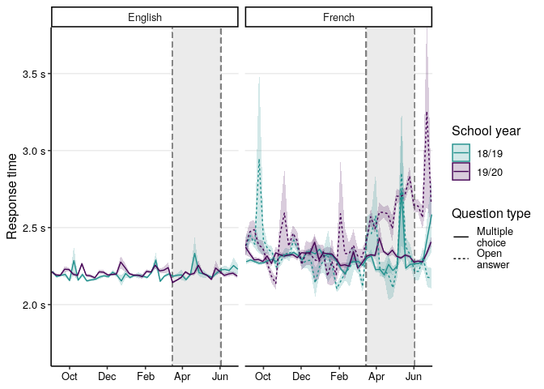
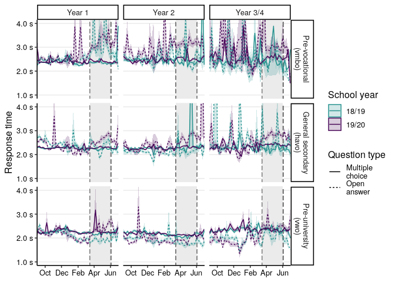
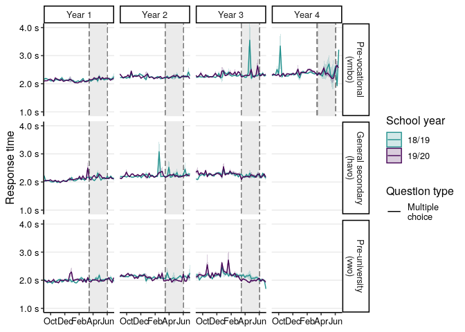

SlimStampen Performance During Lockdown
================
Maarten van der Velde
Last updated: 2021-02-17

# Setup

``` r
library(data.table)
library(DBI)
library(ggplot2)
library(cowplot)
```

    ## 
    ## Attaching package: 'cowplot'

    ## The following object is masked from 'package:ggplot2':
    ## 
    ##     ggsave

``` r
library(grid)
library(lme4)
```

    ## Loading required package: Matrix

``` r
library(lmerTest)
```

    ## 
    ## Attaching package: 'lmerTest'

    ## The following object is masked from 'package:lme4':
    ## 
    ##     lmer

    ## The following object is masked from 'package:stats':
    ## 
    ##     step

``` r
Sys.setlocale("LC_TIME", "en_US.UTF-8") # Print English date format
```

    ## [1] "en_US.UTF-8"

``` r
# Sys.setlocale("LC_TIME", "nl_NL.UTF-8") # Print Dutch date format

number_format <- scales::number_format(big.mark = ",", decimal.mark = ".") # Print English number format
# number_format <- scales::number_format(big.mark = ".", decimal.mark = ",") # Print Dutch number format

theme_paper <- theme_classic(base_size = 12) + 
  theme(axis.text = element_text(colour = "black"),
        panel.grid.major.y = element_line(colour = "grey92"))
```

School closure and opening dates

Sources: -
<https://www.rijksoverheid.nl/actueel/nieuws/2020/03/15/aanvullende-maatregelen-onderwijs-horeca-sport>
-
<https://www.rijksoverheid.nl/actueel/nieuws/2020/05/19/onderwijs-gaat-stap-voor-stap-open>

``` r
date_schools_closed <- as.POSIXct("2020-03-16")
date_schools_opened <- as.POSIXct("2020-06-02")
```

Handle database connections

``` r
db_connect <- function() {
  db <- dbConnect(RSQLite::SQLite(), file.path("..", "data", "noordhoff.sqlite"))
  return(db)
}

db_disconnect <- function(db) {
  dbDisconnect(db)
}
```

# Data

The database contains all SlimStampen data collected via Noordhoff’s
platform in three courses: *Stepping Stones* (English), *Grandes Lignes*
(French), and *Neue Kontakte* (German).

Trial-level response data are stored in the `responses` table. Book
information, such as the course year, book title, and chapter, are
stored in the `book_info`
table.

## `responses`

| Column                 | Type | Explanation                                   |
| ---------------------- | ---- | --------------------------------------------- |
| date                   | int  | UNIX time stamp \[s\]                         |
| user\_id               | chr  | unique user identifier                        |
| method                 | chr  | course                                        |
| start\_time            | int  | elapsed time since session start \[ms\]       |
| rt                     | int  | response time \[ms\]                          |
| duration               | int  | trial duration \[ms\]                         |
| fact\_id               | int  | unique fact identifier (within chapter)       |
| correct                | int  | response accuracy                             |
| answer                 | chr  | user’s response                               |
| choices                | int  | number of answer choices (1 == open response) |
| backspace\_used        | dbl  | user pressed backspace during trial           |
| backspace\_used\_first | dbl  | user erased first character of response       |
| study                  | int  | trial was a study trial                       |
| answer\_language       | chr  | language of the answer                        |
| subsession             | int  | identifies part within learning session       |
| book\_info\_id         | chr  | unique identifier of book information         |

## `book_info`

| Column         | Type | Explanation                             |
| -------------- | ---- | --------------------------------------- |
| book\_info\_id | chr  | unique identifier of book information   |
| method\_group  | chr  | year and edition                        |
| book\_title    | chr  | book title (incl. year, level, edition) |
| book\_type     | chr  | type of book                            |
| chapter        | chr  | chapter number and title                |

Preview first 10 rows

``` r
db <- db_connect()
responses_top <- dbGetQuery(db, "SELECT * FROM responses LIMIT 10")
responses_top
```

    ##          date                              user_id          method
    ## 1  1539683361 08a841d7-e150-4c57-8d3b-8a174ce8c06a Stepping Stones
    ## 2  1539683361 08a841d7-e150-4c57-8d3b-8a174ce8c06a Stepping Stones
    ## 3  1539683361 08a841d7-e150-4c57-8d3b-8a174ce8c06a Stepping Stones
    ## 4  1539683361 08a841d7-e150-4c57-8d3b-8a174ce8c06a Stepping Stones
    ## 5  1539683361 08a841d7-e150-4c57-8d3b-8a174ce8c06a Stepping Stones
    ## 6  1539683361 08a841d7-e150-4c57-8d3b-8a174ce8c06a Stepping Stones
    ## 7  1539683361 08a841d7-e150-4c57-8d3b-8a174ce8c06a Stepping Stones
    ## 8  1539683361 08a841d7-e150-4c57-8d3b-8a174ce8c06a Stepping Stones
    ## 9  1539683361 08a841d7-e150-4c57-8d3b-8a174ce8c06a Stepping Stones
    ## 10 1539683361 08a841d7-e150-4c57-8d3b-8a174ce8c06a Stepping Stones
    ##    start_time   rt duration fact_id correct               answer choices
    ## 1         304 2412     2413       5       1                 fout       4
    ## 2        3783  893      893       5       1                 fout       4
    ## 3        5749 1830     1830       6       1           bergachtig       4
    ## 4        8665 1625     1625       6       1           bergachtig       4
    ## 5       11364 1115     1116       2       1                 rand       4
    ## 6       13595 2697     2697       4       1 vergeven en vergeten       4
    ## 7       17379 1475     1475       2       1                 rand       4
    ## 8       19929 2749     2749       4       1 vergeven en vergeten       4
    ## 9       23825 2851     2851       1       1          je gedragen       4
    ## 10      27927 1940     1940       8       1           bouwvallig       4
    ##    backspace_used backspace_used_first study answer_language subsession
    ## 1              NA                   NA     0              NL          1
    ## 2              NA                   NA     0              NL          1
    ## 3              NA                   NA     0              NL          1
    ## 4              NA                   NA     0              NL          1
    ## 5              NA                   NA     0              NL          1
    ## 6              NA                   NA     0              NL          1
    ## 7              NA                   NA     0              NL          1
    ## 8              NA                   NA     0              NL          1
    ## 9              NA                   NA     0              NL          1
    ## 10             NA                   NA     0              NL          1
    ##                        book_info_id
    ## 1  2562c0861746d69665bc006db57d61d2
    ## 2  2562c0861746d69665bc006db57d61d2
    ## 3  2562c0861746d69665bc006db57d61d2
    ## 4  2562c0861746d69665bc006db57d61d2
    ## 5  2562c0861746d69665bc006db57d61d2
    ## 6  2562c0861746d69665bc006db57d61d2
    ## 7  2562c0861746d69665bc006db57d61d2
    ## 8  2562c0861746d69665bc006db57d61d2
    ## 9  2562c0861746d69665bc006db57d61d2
    ## 10 2562c0861746d69665bc006db57d61d2

``` r
book_info_top <- dbGetQuery(db, "SELECT * FROM book_info LIMIT 10")
book_info_top
```

    ##                        book_info_id        method_group
    ## 1  2562c0861746d69665bc006db57d61d2 Leerjaar 3 (5e Ed.)
    ## 2  2562c0861746d69665bc006db57d61d2 Leerjaar 3 (5e Ed.)
    ## 3  2562c0861746d69665bc006db57d61d2 Leerjaar 3 (5e Ed.)
    ## 4  669e672f2c250b5b93c2b7cbe13f89ee Leerjaar 1 (5e Ed.)
    ## 5  669e672f2c250b5b93c2b7cbe13f89ee Leerjaar 1 (5e Ed.)
    ## 6  fa534b16f415fa69e378fd112acfa6e0 Leerjaar 1 (5e Ed.)
    ## 7  fa534b16f415fa69e378fd112acfa6e0 Leerjaar 1 (5e Ed.)
    ## 8  d144843118b70c545e1c85c91634a1c6 Leerjaar 1 (5e Ed.)
    ## 9  d144843118b70c545e1c85c91634a1c6 Leerjaar 1 (5e Ed.)
    ## 10 d144843118b70c545e1c85c91634a1c6 Leerjaar 1 (5e Ed.)
    ##                book_title          book_type              chapter
    ## 1      3 vmbo gt (5e Ed.)               <NA>                 <NA>
    ## 2      3 vmbo gt (5e Ed.) Activiteitenboek A       2 To the limit
    ## 3      3 vmbo gt (5e Ed.)          Hoofdboek      2 To the limit!
    ## 4  1 vmbo b/lwoo (5e Ed.)               <NA>                 <NA>
    ## 5  1 vmbo b/lwoo (5e Ed.)          Hoofdboek 1 Family and friends
    ## 6  1 vmbo b/lwoo (5e Ed.)               <NA>                 <NA>
    ## 7  1 vmbo b/lwoo (5e Ed.)          Hoofdboek        2 School life
    ## 8  1 vmbo b/lwoo (5e Ed.)               <NA>                 <NA>
    ## 9  1 vmbo b/lwoo (5e Ed.) Activiteitenboek A        2 School life
    ## 10 1 vmbo b/lwoo (5e Ed.)          Hoofdboek        2 School life

``` r
db_disconnect(db)
```

# Performance

There are several measures of learning performance we can look at. The
most straight-forward of these are response accuracy and response time.

Important factors to keep in mind: question type (multiple choice or
open answer) and language. Note that we cannot distinguish between NL-X
and X-X, since we only know the language of the answer.

## Response accuracy

``` r
db <- db_connect()
correct <- dbGetQuery(db, 
                      "SELECT r.method AS 'method',
                      DATE(r.date + 3600, 'unixepoch') AS 'doy',
                      r.user_id AS 'user',
                      r.choices > 1 AS 'mcq',
                      r.correct AS 'correct',
                      COUNT(*) AS 'n'
                      FROM 'responses' r
                      WHERE r.study == 0
                      GROUP BY r.method,
                      DATE(r.date + 3600, 'unixepoch'),
                      r.user_id,
                      r.choices > 1,
                      r.correct"
)
setDT(correct)
db_disconnect(db)
```

Fill in missing rows (where all trials on a day were
correct/incorrect):

``` r
correct <- tidyr::complete(correct, tidyr::nesting(method, doy, user, mcq), correct, fill = list(n = 0))
setDT(correct)
```

``` r
correct[, mcq := as.logical(mcq)]
```

``` r
accuracy <- correct[, .(accuracy = n[correct == 1]/sum(n), n = sum(n)), by = .(method, doy, user, mcq)]
```

Add a school year column (cutoff date: 1 August):

``` r
accuracy[, doy_posix := as.POSIXct(doy)]
accuracy[, school_year := ifelse(doy_posix < "2019-08-01", "18/19", "19/20")]
```

Add sensible course
names:

``` r
accuracy[, course := ifelse(method == "Grandes Lignes", "French", ifelse(method == "Stepping Stones", "English", "German"))]
```

Align school
years:

``` r
accuracy[school_year == "18/19", doy_posix_aligned := as.POSIXct(doy_posix + 365*24*60*60, origin = "1970-01-01")]
accuracy[school_year == "19/20", doy_posix_aligned := doy_posix]
```

Use cut.Date() to bin dates by week. Each day is assigned the date of
the most recent Monday.

``` r
accuracy[, doy_posix_week := cut.POSIXt(doy_posix, "week")]
accuracy[, doy_posix_aligned_week := cut.POSIXt(doy_posix_aligned, "week")]
```

``` r
accuracy_by_week_and_user <- accuracy[, .(accuracy = mean(accuracy, na.rm = TRUE)), by = .(course, school_year, doy_posix_aligned_week, user, mcq)]

accuracy_by_week <- accuracy_by_week_and_user[, .(accuracy_mean = mean(accuracy, na.rm = TRUE),
                              accuracy_se = sd(accuracy, na.rm = TRUE)/sqrt(.N), n = .N), by = .(course, school_year, doy_posix_aligned_week, mcq)]
```

Add question type
labels:

``` r
accuracy_by_week[, question_type := ifelse(mcq == TRUE, "Multiple\nchoice", "Open\nanswer")]
```

Plot response accuracy by week (mean +/- 1
SE).

``` r
p_acc <- ggplot(accuracy_by_week[(course == "English" & mcq == TRUE) | course == "French",],
            aes(x = as.POSIXct(doy_posix_aligned_week), y = accuracy_mean, group = interaction(school_year, question_type), colour = school_year, fill = school_year)) +
  facet_grid(. ~ course) +
  geom_rect(xmin = date_schools_closed, xmax = date_schools_opened, ymin = 0, ymax = 1.05, fill = "grey92", colour = "grey50", lty = 2, alpha = .9) +
  geom_ribbon(aes(ymin = accuracy_mean - accuracy_se, ymax = accuracy_mean + accuracy_se, colour = NULL), alpha = 0.2) +
  geom_line(aes(lty = question_type)) +
  scale_x_datetime(expand = c(0, 0),
                   breaks = as.POSIXct(c(
                     "2019-10-01 02:00:00 CET",
                     "2019-12-01 02:00:00 CET",
                     "2020-02-01 02:00:00 CET",
                     "2020-04-01 02:00:00 CET",
                     "2020-06-01 02:00:00 CET")),
                   limits = as.POSIXct(c("2019-09-01 02:00:00 CET", "2020-07-01 02:00:00 CET")),
                   date_labels = "%b") +
  scale_y_continuous(limits = c(.7, 1), labels = scales::percent_format(accuracy = 1)) +
  scale_colour_viridis_d(end = .5, direction = -1, na.translate = FALSE) +
  scale_fill_viridis_d(end = .5, direction = -1, na.translate = FALSE) +
  labs(x = NULL,
       y = "Accuracy",
       colour = "School year",
       fill = "School year",
       lty = "Question type") +
  guides(colour = guide_legend(order = 1),
         fill = guide_legend(order = 1),
         lty = guide_legend(order = 2)) +
  theme_paper

p_acc
```

    ## Warning: Removed 24 row(s) containing missing values (geom_path).

<!-- -->

``` r
ggsave("../output/acc_by_question_type.pdf", width = 9, height = 3)
```

    ## Warning: Removed 24 row(s) containing missing values (geom_path).

``` r
ggsave("../output/acc_by_question_type.png", width = 9, height = 3)
```

    ## Warning: Removed 24 row(s) containing missing values (geom_path).

Fit a mixed effects model to the daily accuracy data:

``` r
accuracy[, period := dplyr::case_when(
  doy_posix_aligned >= date_schools_opened ~ "post-lockdown",
  doy_posix_aligned >= date_schools_closed & doy_posix_aligned < date_schools_opened ~ "during-lockdown",
  doy_posix_aligned < date_schools_opened ~ "pre-lockdown"
)]

# Reorder factor levels so that intercept is pre-lockdown open answer in 19/20
accuracy[, period := factor(period, levels = c("pre-lockdown", "during-lockdown", "post-lockdown"))]
accuracy[, school_year := factor(school_year, levels = c("19/20", "18/19"))]
accuracy[, mcq := factor(mcq, levels = c(FALSE, TRUE))]
```

Since we know the number of trials per day and the proportion correct
(accuracy), we can use a binomial GLMM:

``` r
if(!file.exists("../output/m_acc_fit.rds")) {
  m_acc <- glmer(accuracy ~ period*school_year*mcq + (1 | user) + (1 | course),
                 data = accuracy[(course == "English" & mcq == TRUE) | course == "French",],
                 family = "binomial", 
                 weights = n,
                 nAGQ = 0,
                 control = glmerControl(optimizer = "bobyqa", optCtrl = list(maxfun = 1e6)))
  saveRDS(m_acc, "../output/m_acc_fit.rds")
} else {
  m_acc <- readRDS("../output/m_acc_fit.rds")
}

m_acc_summary <- summary(m_acc)
m_acc_summary
```

    ## Generalized linear mixed model fit by maximum likelihood (Adaptive
    ##   Gauss-Hermite Quadrature, nAGQ = 0) [glmerMod]
    ##  Family: binomial  ( logit )
    ## Formula: accuracy ~ period * school_year * mcq + (1 | user) + (1 | course)
    ##    Data: 
    ## accuracy[(course == "English" & mcq == TRUE) | course == "French",      ]
    ## Weights: n
    ## Control: 
    ## glmerControl(optimizer = "bobyqa", optCtrl = list(maxfun = 1e+06))
    ## 
    ##      AIC      BIC   logLik deviance df.resid 
    ##  4963073  4963232 -2481522  4963045   671406 
    ## 
    ## Scaled residuals: 
    ##      Min       1Q   Median       3Q      Max 
    ## -23.9963  -0.9227   0.1606   1.0936  11.4371 
    ## 
    ## Random effects:
    ##  Groups Name        Variance Std.Dev.
    ##  user   (Intercept) 0.35034  0.5919  
    ##  course (Intercept) 0.05511  0.2348  
    ## Number of obs: 671420, groups:  user, 133419; course, 2
    ## 
    ## Fixed effects:
    ##                                                 Estimate Std. Error
    ## (Intercept)                                     1.631257   0.166016
    ## periodduring-lockdown                           0.259227   0.002725
    ## periodpost-lockdown                             0.150384   0.004021
    ## school_year18/19                                0.117385   0.002566
    ## mcqTRUE                                         0.960249   0.002088
    ## periodduring-lockdown:school_year18/19         -0.311338   0.004409
    ## periodpost-lockdown:school_year18/19           -0.242816   0.006325
    ## periodduring-lockdown:mcqTRUE                  -0.328352   0.002881
    ## periodpost-lockdown:mcqTRUE                    -0.277485   0.004397
    ## school_year18/19:mcqTRUE                        0.003357   0.002667
    ## periodduring-lockdown:school_year18/19:mcqTRUE  0.379504   0.004758
    ## periodpost-lockdown:school_year18/19:mcqTRUE    0.335859   0.006970
    ##                                                 z value Pr(>|z|)    
    ## (Intercept)                                       9.826   <2e-16 ***
    ## periodduring-lockdown                            95.142   <2e-16 ***
    ## periodpost-lockdown                              37.399   <2e-16 ***
    ## school_year18/19                                 45.755   <2e-16 ***
    ## mcqTRUE                                         459.903   <2e-16 ***
    ## periodduring-lockdown:school_year18/19          -70.613   <2e-16 ***
    ## periodpost-lockdown:school_year18/19            -38.387   <2e-16 ***
    ## periodduring-lockdown:mcqTRUE                  -113.954   <2e-16 ***
    ## periodpost-lockdown:mcqTRUE                     -63.110   <2e-16 ***
    ## school_year18/19:mcqTRUE                          1.259    0.208    
    ## periodduring-lockdown:school_year18/19:mcqTRUE   79.765   <2e-16 ***
    ## periodpost-lockdown:school_year18/19:mcqTRUE     48.183   <2e-16 ***
    ## ---
    ## Signif. codes:  0 '***' 0.001 '**' 0.01 '*' 0.05 '.' 0.1 ' ' 1
    ## 
    ## Correlation of Fixed Effects:
    ##                   (Intr) prddr- prdps- sc_18/19 mcTRUE prdd-:_18/19
    ## prddrng-lck       -0.007                                           
    ## prdpst-lckd       -0.005  0.346                                    
    ## schl_y18/19       -0.008  0.452  0.297                             
    ## mcqTRUE           -0.010  0.534  0.352  0.592                      
    ## prdd-:_18/19       0.005 -0.626 -0.217 -0.505   -0.340             
    ## prdp-:_18/19       0.003 -0.229 -0.640 -0.351   -0.233  0.241      
    ## prddr-:TRUE        0.007 -0.824 -0.278 -0.412   -0.649  0.516      
    ## prdps-:TRUE        0.004 -0.269 -0.824 -0.264   -0.419  0.169      
    ## s_18/19:TRU        0.007 -0.409 -0.270 -0.837   -0.697  0.450      
    ## prdd-:_18/19:TRUE -0.004  0.506  0.171  0.439    0.405 -0.854      
    ## prdp-:_18/19:TRUE -0.003  0.176  0.523  0.298    0.273 -0.190      
    ##                   prdp-:_18/19 prdd-:TRUE prdp-:TRUE s_18/19:
    ## prddrng-lck                                                  
    ## prdpst-lckd                                                  
    ## schl_y18/19                                                  
    ## mcqTRUE                                                      
    ## prdd-:_18/19                                                 
    ## prdp-:_18/19                                                 
    ## prddr-:TRUE        0.183                                     
    ## prdps-:TRUE        0.527        0.315                        
    ## s_18/19:TRU        0.311        0.481      0.310             
    ## prdd-:_18/19:TRUE -0.194       -0.612     -0.194     -0.523  
    ## prdp-:_18/19:TRUE -0.843       -0.205     -0.634     -0.358  
    ##                   prdd-:_18/19:TRUE
    ## prddrng-lck                        
    ## prdpst-lckd                        
    ## schl_y18/19                        
    ## mcqTRUE                            
    ## prdd-:_18/19                       
    ## prdp-:_18/19                       
    ## prddr-:TRUE                        
    ## prdps-:TRUE                        
    ## s_18/19:TRU                        
    ## prdd-:_18/19:TRUE                  
    ## prdp-:_18/19:TRUE  0.221

Save coefficients as a table for in the paper:

``` r
m_acc_coef <- as.data.frame(m_acc_summary$coefficients)
setDT(m_acc_coef, keep.rownames = TRUE)
m_acc_coef$rn <- c("Intercept \\small{(Period: pre-lockdown, School year: 19/20, Question type: open answer)}",
                   "Period: lockdown",
                   "Period: post-lockdown",
                   "School year: 18/19",
                   "Question type: multiple choice",
                   "Period: lockdown $\\times$ School year: 18/19",
                   "Period: post-lockdown $\\times$ School year: 18/19",
                   "Period: lockdown $\\times$ Question type: multiple choice",
                   "Period: post-lockdown $\\times$ Question type: multiple choice",
                   "School year: 18/19 $\\times$ Question type: multiple choice",
                   "Period: lockdown $\\times$ School year: 18/19 $\\times$ Question type: multiple choice",
                   "Period: post-lockdown $\\times$ School year: 18/19 $\\times$ Question type: multiple choice")

# Format p-values
m_acc_coef$`Pr(>|z|)` <- format.pval(m_acc_coef$`Pr(>|z|)`, eps = .001, digits = 3, flag = "0")
m_acc_coef$`Pr(>|z|)` <- sub('^(<)?0[.]', '\\1.', m_acc_coef$`Pr(>|z|)`) # Remove leading zero

cat(knitr::kable(m_acc_coef,
                 align = c("l","r", "r", "r", "r"),
                 digits = c(NA, 3, 3, 2, NA),
                 col.names = c("Effect", "$b$", "SE", "$z$", "$p$"),
                 format = "latex",
                 booktabs = TRUE,
                 escape = FALSE),
    file = "../output/m_acc_table.tex")
```

Visualise the model
fit:

``` r
acc_fit <- expand.grid(period = c("pre-lockdown", "during-lockdown", "post-lockdown"), school_year = c("18/19", "19/20"), mcq = c(TRUE, FALSE))
acc_fit <- cbind(acc_fit, accuracy = predict(m_acc, type = "response", re.form = NA, newdata = acc_fit))
acc_fit
```

    ##             period school_year   mcq  accuracy
    ## 1     pre-lockdown       18/19  TRUE 0.9377455
    ## 2  during-lockdown       18/19  TRUE 0.9376895
    ## 3    post-lockdown       18/19  TRUE 0.9357274
    ## 4     pre-lockdown       19/20  TRUE 0.9303129
    ## 5  during-lockdown       19/20  TRUE 0.9256960
    ## 6    post-lockdown       19/20  TRUE 0.9216085
    ## 7     pre-lockdown       18/19 FALSE 0.8517815
    ## 8  during-lockdown       18/19 FALSE 0.8450812
    ## 9    post-lockdown       18/19 FALSE 0.8397286
    ## 10    pre-lockdown       19/20 FALSE 0.8363418
    ## 11 during-lockdown       19/20 FALSE 0.8688108
    ## 12   post-lockdown       19/20 FALSE 0.8558994

``` r
ggplot(acc_fit, aes(x = period, y = accuracy, colour = school_year, lty = mcq, group = interaction(mcq, school_year))) +
  geom_line() +
  geom_point() +
  scale_y_continuous(limits = c(.7, 1), labels = scales::percent_format()) +
  theme_paper
```

<!-- -->

Empirical
means:

``` r
accuracy_mean <- accuracy[(course == "English" & mcq == TRUE) | course == "French", .(accuracy = sum(accuracy * n)/sum(n)), by = .(period, school_year, mcq, user, course)][, .(accuracy = mean(accuracy), accuracy_sd = sd(accuracy)), by = .(period, school_year, mcq)]
accuracy_mean
```

    ##              period school_year   mcq  accuracy accuracy_sd
    ##  1:    pre-lockdown       18/19 FALSE 0.7750858  0.17982054
    ##  2:    pre-lockdown       18/19  TRUE 0.9336483  0.05318888
    ##  3: during-lockdown       18/19 FALSE 0.7760562  0.19067498
    ##  4: during-lockdown       18/19  TRUE 0.9321542  0.05725342
    ##  5:   post-lockdown       18/19 FALSE 0.7740634  0.18808125
    ##  6:   post-lockdown       18/19  TRUE 0.9298982  0.06057743
    ##  7:    pre-lockdown       19/20 FALSE 0.7747315  0.17771071
    ##  8:    pre-lockdown       19/20  TRUE 0.9321531  0.05262399
    ##  9: during-lockdown       19/20 FALSE 0.8363835  0.15253436
    ## 10: during-lockdown       19/20  TRUE 0.9251013  0.05436634
    ## 11:   post-lockdown       19/20 FALSE 0.8198012  0.17941968
    ## 12:   post-lockdown       19/20  TRUE 0.9199978  0.06127651

``` r
ggplot(accuracy_mean, aes(x = period, y = accuracy, colour = school_year, lty = mcq, group = interaction(mcq, school_year))) +
  geom_line() +
  geom_point() +
  scale_y_continuous(limits = c(.7, 1), labels = scales::percent_format()) +
  theme_paper
```

<!-- -->

## Response time

``` r
db <- db_connect()
rt <- dbGetQuery(db, 
                 "SELECT r.method AS 'method',
                  DATE(r.date + 3600, 'unixepoch') AS 'doy',
                  r.user_id AS 'user',
                  r.choices > 1 AS 'mcq',
                  r.rt AS 'rt'
                  FROM 'responses' r
                  WHERE r.study == 0
                  AND r.correct == 1
                 "
)
setDT(rt)
db_disconnect(db)
```

``` r
doys <- rt[, .(doy = unique(doy))][, doy_posix := as.POSIXct(doy)][]
doys[, doy_posix_week := cut.POSIXt(as.POSIXct(doy), "week")]
doys[, school_year := ifelse(doy_posix < "2019-08-01", "18/19", "19/20")]
doys[school_year == "18/19", doy_posix_aligned := as.POSIXct(doy_posix + 365*24*60*60, origin = "1970-01-01")]
doys[school_year == "19/20", doy_posix_aligned := doy_posix]
doys[, period := dplyr::case_when(
  doy_posix_aligned >= date_schools_opened ~ "post-lockdown",
  doy_posix_aligned >= date_schools_closed & doy_posix_aligned < date_schools_opened ~ "during-lockdown",
  doy_posix_aligned < date_schools_opened ~ "pre-lockdown"
)]

# Reorder factor levels so that intercept is pre-lockdown in 19/20
doys[, period := factor(period, levels = c("pre-lockdown", "during-lockdown", "post-lockdown"))]
doys[, school_year := factor(school_year, levels = c("19/20", "18/19"))]
```

``` r
rt <- rt[doys, on = "doy"]
```

``` r
rt[, mcq := as.factor(as.logical(mcq))]
```

``` r
rt[, course := ifelse(method == "Grandes Lignes", "French", ifelse(method == "Stepping Stones", "English", "German"))]
```

Throw out trials with negative RTs (timing
errors)

``` r
rt <- rt[rt > 0]
```

``` r
rt_med <- rt[, .(rt_median = median(rt)), by = .(period, school_year, mcq, user, course, doy_posix_week)]

rt_by_week <- rt_med[, .(rt = mean(rt_median), rt_se = sd(rt_median)/sqrt(.N)), by = .(period, school_year, mcq, course, doy_posix_week)]
```

Overlap the two school
years:

``` r
rt_by_week[school_year == "18/19", doy_posix_week_aligned := as.POSIXct(as.POSIXct(doy_posix_week) + 365*24*60*60, origin = "1970-01-01")]
rt_by_week[school_year == "19/20", doy_posix_week_aligned := as.POSIXct(doy_posix_week)]
```

Add question type
labels:

``` r
rt_by_week[, question_type := ifelse(mcq == TRUE, "Multiple\nchoice", "Open\nanswer")]
```

``` r
rt_by_week[, school_year := factor(school_year, levels = c("18/19", "19/20"))]
```

Plot response time by week (mean +/- 1
SE).

``` r
p_rt <- ggplot(rt_by_week[(course == "English" & mcq == TRUE) | course == "French",],
            aes(x = doy_posix_week_aligned, y = rt/1e3, group = interaction(school_year, question_type), colour = school_year, fill = school_year)) +
  facet_grid(. ~ course) +
  geom_rect(xmin = date_schools_closed, xmax = date_schools_opened, ymin = 0, ymax = 1000, fill = "grey92", colour = "grey50", lty = 2, alpha = .9) +
  geom_ribbon(aes(ymin = rt/1e3 - rt_se/1e3, ymax = rt/1e3 + rt_se/1e3, colour = NULL), alpha = 0.2) +
  geom_line(aes(lty = question_type)) +
  scale_x_datetime(expand = c(0, 0),
                   breaks = as.POSIXct(c(
                     "2019-10-01 02:00:00 CET",
                     "2019-12-01 02:00:00 CET",
                     "2020-02-01 02:00:00 CET",
                     "2020-04-01 02:00:00 CET",
                     "2020-06-01 02:00:00 CET")),
                   limits = as.POSIXct(c("2019-09-01 02:00:00 CET", "2020-07-01 02:00:00 CET")),
                   date_labels = "%b") +
  scale_y_continuous(limits = c(1.7, 3.7), labels = scales::unit_format(unit = "s", accuracy = .1)) +
  scale_colour_viridis_d(end = .5, direction = -1, na.translate = FALSE) +
  scale_fill_viridis_d(end = .5, direction = -1, na.translate = FALSE) +
  labs(x = NULL,
       y = "Response time",
       colour = "School year",
       fill = "School year",
       lty = "Question type") +
  guides(colour = guide_legend(order = 1),
         fill = guide_legend(order = 1),
         lty = guide_legend(order = 2)) +
  theme_paper

p_rt
```

    ## Warning: Removed 24 row(s) containing missing values (geom_path).

<!-- -->

``` r
ggsave("../output/rt_by_question_type.pdf", width = 9, height = 3)
```

    ## Warning: Removed 24 row(s) containing missing values (geom_path).

``` r
ggsave("../output/rt_by_question_type.png", width = 9, height = 3)
```

    ## Warning: Removed 24 row(s) containing missing values (geom_path).

Fit a generalised linear mixed effects model (assuming a Gamma
distribution for RT and an identity link function; Lo & Andrew, 2015) to
the daily median RT:

``` r
if(!file.exists("../output/m_rt_fit.rds")) {
  m_rt <- glmer(rt_median ~ period*school_year*mcq + (1 | user) + (1 | course),
                 data = rt_med[(course == "English" & mcq == TRUE) | course == "French",],
                 family = Gamma(link = "identity"),
                 nAGQ = 0,
                 control = glmerControl(optimizer = "bobyqa", optCtrl = list(maxfun = 1e6)))
  saveRDS(m_rt, "../output/m_rt_fit.rds")
} else {
  m_rt <- readRDS("../output/m_rt_fit.rds")
}

m_rt_summary <- summary(m_rt)
m_rt_summary
```

    ## Generalized linear mixed model fit by maximum likelihood (Adaptive
    ##   Gauss-Hermite Quadrature, nAGQ = 0) [glmerMod]
    ##  Family: Gamma  ( identity )
    ## Formula: 
    ## rt_median ~ period * school_year * mcq + (1 | user) + (1 | course)
    ##    Data: rt_med[(course == "English" & mcq == TRUE) | course == "French",  
    ##     ]
    ## Control: 
    ## glmerControl(optimizer = "bobyqa", optCtrl = list(maxfun = 1e+06))
    ## 
    ##      AIC      BIC   logLik deviance df.resid 
    ##  8752537  8752706 -4376253  8752507   568060 
    ## 
    ## Scaled residuals: 
    ##     Min      1Q  Median      3Q     Max 
    ##  -2.796  -0.339  -0.065   0.244 226.790 
    ## 
    ## Random effects:
    ##  Groups   Name        Variance  Std.Dev.
    ##  user     (Intercept) 2.707e+05 520.2651
    ##  course   (Intercept) 1.811e+02  13.4560
    ##  Residual             1.264e-01   0.3555
    ## Number of obs: 568075, groups:  user, 133398; course, 2
    ## 
    ## Fixed effects:
    ##                                                Estimate Std. Error t value
    ## (Intercept)                                    2131.760     10.943 194.814
    ## periodduring-lockdown                           208.067      7.280  28.580
    ## periodpost-lockdown                             202.435     11.240  18.010
    ## school_year18/19                                 25.435      6.860   3.708
    ## mcqTRUE                                         145.710      5.661  25.739
    ## periodduring-lockdown:school_year18/19         -275.585     11.913 -23.133
    ## periodpost-lockdown:school_year18/19           -310.462     17.959 -17.288
    ## periodduring-lockdown:mcqTRUE                  -210.329      7.860 -26.761
    ## periodpost-lockdown:mcqTRUE                    -204.176     12.436 -16.417
    ## school_year18/19:mcqTRUE                        -58.248      7.226  -8.061
    ## periodduring-lockdown:school_year18/19:mcqTRUE  274.439     12.877  21.312
    ## periodpost-lockdown:school_year18/19:mcqTRUE    336.311     19.768  17.013
    ##                                                Pr(>|z|)    
    ## (Intercept)                                     < 2e-16 ***
    ## periodduring-lockdown                           < 2e-16 ***
    ## periodpost-lockdown                             < 2e-16 ***
    ## school_year18/19                               0.000209 ***
    ## mcqTRUE                                         < 2e-16 ***
    ## periodduring-lockdown:school_year18/19          < 2e-16 ***
    ## periodpost-lockdown:school_year18/19            < 2e-16 ***
    ## periodduring-lockdown:mcqTRUE                   < 2e-16 ***
    ## periodpost-lockdown:mcqTRUE                     < 2e-16 ***
    ## school_year18/19:mcqTRUE                       7.57e-16 ***
    ## periodduring-lockdown:school_year18/19:mcqTRUE  < 2e-16 ***
    ## periodpost-lockdown:school_year18/19:mcqTRUE    < 2e-16 ***
    ## ---
    ## Signif. codes:  0 '***' 0.001 '**' 0.01 '*' 0.05 '.' 0.1 ' ' 1
    ## 
    ## Correlation of Fixed Effects:
    ##                   (Intr) prddr- prdps- sc_18/19 mcTRUE prdd-:_18/19
    ## prddrng-lck       -0.313                                           
    ## prdpst-lckd       -0.201  0.334                                    
    ## schl_y18/19       -0.347  0.487  0.313                             
    ## mcqTRUE           -0.419  0.568  0.367  0.623                      
    ## prdd-:_18/19       0.198 -0.618 -0.207 -0.534   -0.353             
    ## prdp-:_18/19       0.131 -0.215 -0.629 -0.356   -0.235  0.229      
    ## prddr-:TRUE        0.283 -0.862 -0.281 -0.437   -0.650  0.531      
    ## prdps-:TRUE        0.178 -0.274 -0.856 -0.275   -0.410  0.170      
    ## s_18/19:TRU        0.308 -0.443 -0.285 -0.880   -0.706  0.484      
    ## prdd-:_18/19:TRUE -0.177  0.531  0.173  0.475    0.403 -0.883      
    ## prdp-:_18/19:TRUE -0.115  0.176  0.541  0.310    0.263 -0.190      
    ##                   prdp-:_18/19 prdd-:TRUE prdp-:TRUE s_18/19:
    ## prddrng-lck                                                  
    ## prdpst-lckd                                                  
    ## schl_y18/19                                                  
    ## mcqTRUE                                                      
    ## prdd-:_18/19                                                 
    ## prdp-:_18/19                                                 
    ## prddr-:TRUE        0.179                                     
    ## prdps-:TRUE        0.538        0.302                        
    ## s_18/19:TRU        0.322        0.492      0.309             
    ## prdd-:_18/19:TRUE -0.194       -0.614     -0.186     -0.539  
    ## prdp-:_18/19:TRUE -0.872       -0.194     -0.631     -0.353  
    ##                   prdd-:_18/19:TRUE
    ## prddrng-lck                        
    ## prdpst-lckd                        
    ## schl_y18/19                        
    ## mcqTRUE                            
    ## prdd-:_18/19                       
    ## prdp-:_18/19                       
    ## prddr-:TRUE                        
    ## prdps-:TRUE                        
    ## s_18/19:TRU                        
    ## prdd-:_18/19:TRUE                  
    ## prdp-:_18/19:TRUE  0.211

Save coefficients as a table for in the paper:

``` r
m_rt_coef <- as.data.frame(m_rt_summary$coefficients)
setDT(m_rt_coef, keep.rownames = TRUE)
m_rt_coef$rn <- c("Intercept \\small{(Period: pre-lockdown, School year: 19/20, Question type: open answer)}",
                   "Period: lockdown",
                   "Period: post-lockdown",
                   "School year: 18/19",
                   "Question type: multiple choice",
                   "Period: lockdown $\\times$ School year: 18/19",
                   "Period: post-lockdown $\\times$ School year: 18/19",
                   "Period: lockdown $\\times$ Question type: multiple choice",
                   "Period: post-lockdown $\\times$ Question type: multiple choice",
                   "School year: 18/19 $\\times$ Question type: multiple choice",
                   "Period: lockdown $\\times$ School year: 18/19 $\\times$ Question type: multiple choice",
                   "Period: post-lockdown $\\times$ School year: 18/19 $\\times$ Question type: multiple choice")

# Format p-values
m_rt_coef$`Pr(>|z|)` <- format.pval(m_rt_coef$`Pr(>|z|)`, eps = .001, digits = 3, flag = "0")
m_rt_coef$`Pr(>|z|)` <- sub('^(<)?0[.]', '\\1.', m_rt_coef$`Pr(>|z|)`) # Remove leading zero

cat(knitr::kable(m_rt_coef,
                 align = c("l","r", "r", "r", "r"),
                 digits = c(NA, 3, 3, 2, NA),
                 col.names = c("Effect", "$b$", "SE", "$z$", "$p$"),
                 format = "latex",
                 booktabs = TRUE,
                 escape = FALSE),
    file = "../output/m_rt_table.tex")
```

Visualise the model
fit:

``` r
rt_fit <- expand.grid(period = c("pre-lockdown", "during-lockdown", "post-lockdown"), school_year = c("18/19", "19/20"), mcq = c(TRUE, FALSE))
rt_fit <- cbind(rt_fit, rt = predict(m_rt, type = "response", re.form = NA, newdata = rt_fit))
rt_fit
```

    ##             period school_year   mcq       rt
    ## 1     pre-lockdown       18/19  TRUE 2244.657
    ## 2  during-lockdown       18/19  TRUE 2241.250
    ## 3    post-lockdown       18/19  TRUE 2268.765
    ## 4     pre-lockdown       19/20  TRUE 2277.470
    ## 5  during-lockdown       19/20  TRUE 2275.208
    ## 6    post-lockdown       19/20  TRUE 2275.729
    ## 7     pre-lockdown       18/19 FALSE 2157.196
    ## 8  during-lockdown       18/19 FALSE 2089.678
    ## 9    post-lockdown       18/19 FALSE 2049.169
    ## 10    pre-lockdown       19/20 FALSE 2131.760
    ## 11 during-lockdown       19/20 FALSE 2339.828
    ## 12   post-lockdown       19/20 FALSE 2334.196

``` r
ggplot(rt_fit, aes(x = period, y = rt, colour = school_year, lty = mcq, group = interaction(mcq, school_year))) +
  geom_line() +
  geom_point() +
  scale_y_continuous(limits = c(1500, 4000)) +
  theme_paper
```

<!-- -->

Empirical
means:

``` r
rt_mean <- rt_med[(course == "English" & mcq == TRUE) | course == "French", .(rt = mean(rt_median)), by = .(period, school_year, mcq, user, course)][, .(rt = mean(rt), rt_sd = sd(rt)), by = .(period, school_year, mcq, course)]
rt_mean[, school_year := factor(school_year, levels = c("18/19", "19/20"))]
rt_mean
```

    ##              period school_year   mcq  course       rt     rt_sd
    ##  1:    pre-lockdown       18/19  TRUE English 2205.742 2573.2414
    ##  2:    pre-lockdown       18/19  TRUE  French 2341.638  580.6344
    ##  3:    pre-lockdown       18/19 FALSE  French 2440.779 8970.7395
    ##  4: during-lockdown       18/19  TRUE English 2197.070 1116.4534
    ##  5: during-lockdown       18/19  TRUE  French 2371.042 5658.8866
    ##  6: during-lockdown       18/19 FALSE  French 2429.875 7199.3615
    ##  7:   post-lockdown       18/19  TRUE English 2228.774 1100.5364
    ##  8:   post-lockdown       18/19  TRUE  French 2363.443 2226.1941
    ##  9:   post-lockdown       18/19 FALSE  French 2204.874 1538.2594
    ## 10:    pre-lockdown       19/20  TRUE English 2218.666  823.8789
    ## 11:    pre-lockdown       19/20  TRUE  French 2361.963 1001.5762
    ## 12:    pre-lockdown       19/20 FALSE  French 2422.505 4494.2201
    ## 13: during-lockdown       19/20  TRUE English 2194.701  597.7885
    ## 14: during-lockdown       19/20  TRUE  French 2361.611 1372.1367
    ## 15: during-lockdown       19/20 FALSE  French 2673.003 2653.2305
    ## 16:   post-lockdown       19/20  TRUE English 2208.724  710.2326
    ## 17:   post-lockdown       19/20  TRUE  French 2318.509  557.9095
    ## 18:   post-lockdown       19/20 FALSE  French 2677.193 2500.3927

``` r
ggplot(rt_mean, aes(x = period, y = rt, colour = school_year, lty = mcq, group = interaction(mcq, school_year))) +
  facet_grid(~ course) +
  geom_line() +
  geom_point() +
  scale_y_continuous(limits = c(1500, 3000)) +
  theme_paper
```

<!-- -->

## Combination plot

``` r
p_legend <- get_legend(p_acc)
```

    ## Warning: Removed 24 row(s) containing missing values (geom_path).

``` r
p_acc <- p_acc +
  guides(colour = FALSE, fill = FALSE, lty = FALSE)

p_rt <- p_rt +
  guides(colour = FALSE, fill = FALSE, lty = FALSE)
```

Combine plots:

``` r
plot_grid(
  plot_grid(p_acc, p_rt,
            ncol = 1,
            labels = c("A", "B")),
  p_legend,
  rel_widths = c(1, .2)
)
```

    ## Warning: Removed 24 row(s) containing missing values (geom_path).
    
    ## Warning: Removed 24 row(s) containing missing values (geom_path).

<!-- -->

``` r
ggsave("../output/combi_acc_rt.pdf", width = 9, height = 3.5)
ggsave("../output/combi_acc_rt.png", width = 9, height = 3.5)
```

# Learning progress

Get the unique book chapter IDs on each day:

``` r
db <- db_connect()

progress <- dbGetQuery(db,
                       "SELECT DISTINCT r.book_info_id AS 'book_info_id',
                        r.method AS 'method',
                        DATE(r.date + 3600, 'unixepoch') AS 'doy',
                        COUNT(*) AS 'trials'
                        FROM 'responses' r
                        GROUP BY r.method,
                        r.book_info_id,
                        DATE(r.date + 3600, 'unixepoch');"
                       )

db_disconnect(db)

setDT(progress)
```

Join with the book chapter information:

``` r
db <- db_connect()
book_info <- dbGetQuery(db, "SELECT DISTINCT * FROM 'book_info'")
db_disconnect(db)

setDT(book_info)
```

``` r
progress[book_info[book_type == "Hoofdboek",], on  = "book_info_id", c("method_group", "book_title", "chapter") := .(i.method_group, i.book_title, i.chapter)]
```

Add sensible course
names:

``` r
progress[, course := ifelse(method == "Grandes Lignes", "French", ifelse(method == "Stepping Stones", "English", "German"))]
```

Add a school year column (cutoff date: 1 August):

``` r
progress[, doy_posix := as.POSIXct(doy)]
progress[, school_year := ifelse(doy_posix < "2019-08-01", "18/19", "19/20")]
```

Consolidate count by day and
chapter:

``` r
progress_by_day <- progress[, .(trials = sum(trials)), by = .(school_year, doy_posix, course, method_group, book_title, chapter)]
```

Simplify level names:

``` r
# Keep all distinctions
progress_by_day[, book_title_simple := stringr::str_sub(book_title, 3, -10)]
progress_by_day[, book_title_simple := factor(book_title_simple, levels = c("vmbo b/lwoo", "vmbo b", "vmbo bk", "vmbo k", "vmbo kgt", "vmbo-gt", "vmbo gt", "vmbo-gt/havo", "vmbo (t)hv", "havo", "havo vwo", "vwo"))]

# Simplify to three levels
progress_by_day[, level := dplyr::case_when(
  grepl( "hv", book_title) ~ "General secondary (havo)",
  grepl("vmbo", book_title) ~ "Pre-vocational (vmbo)",
  grepl("havo", book_title) ~ "General secondary (havo)",
  grepl("vwo", book_title) ~ "Pre-university (vwo)",
  TRUE ~ "Other")]
progress_by_day[, level := factor(level, levels = c("Other", "Pre-vocational (vmbo)", "General secondary (havo)", "Pre-university (vwo)"))]
```

Simplify year names:

``` r
progress_by_day[, year := dplyr::case_when(
  method_group == "Leerjaar 1 (5e Ed.)" ~ "Year 1",
  method_group == "Leerjaar 2 (5e Ed.)" ~ "Year 2",
  method_group == "Leerjaar 3 (5e Ed.)" ~ "Year 3",
  method_group == "Leerjaar 3/4 (5e Ed.)" ~ "Year 3/4",
  method_group == "Leerjaar 4 (5e Ed.)" ~ "Year 4",
  method_group == "Tweede Fase (6e Ed.)" ~ "Tweede Fase",
  TRUE ~ "Other")]
```

Simplify chapter names:

``` r
# In most cases, the chapter name starts with a number
progress_by_day[, chapter_simple := factor(as.numeric(stringr::str_extract(chapter, "^\\d{1,2}")))]

# Remaining cases:
unique(progress_by_day[is.na(chapter_simple),]$chapter)
```

    ##  [1] "BS2 Dienstleistung"               
    ##  [2] "BS5 Reisen"                       
    ##  [3] "BS1 Familie und Beziehungen"      
    ##  [4] "BS3 Dienstleistung"               
    ##  [5] "BS4 Reisen und Verkehr"           
    ##  [6] "Lernliste Brückenschlag"          
    ##  [7] "BS2 Freizeit"                     
    ##  [8] "BS1 Schule und Ausbildung"        
    ##  [9] "Bridging the Gap Year 2"          
    ## [10] "Bridging the Gap Year 1"          
    ## [11] "Bridging the Gap Exam Preparation"
    ## [12] "Exam Preparation"                 
    ## [13] "Bridging the Gap mbo"             
    ## [14] "Bridging the Gap havo"

``` r
# Combine these chapters into an "other" category
progress_by_day[is.na(chapter_simple), chapter_simple := "O"]
```

Align school
years:

``` r
progress_by_day[school_year == "18/19", doy_posix_aligned := as.POSIXct(doy_posix + 365*24*60*60, origin = "1970-01-01")]
progress_by_day[school_year == "19/20", doy_posix_aligned := doy_posix]
```

Use cut.Date() to bin dates by week and month. Each day is assigned the
date of the most recent
Monday.

``` r
progress_by_day[, doy_posix_aligned_week := cut.POSIXt(doy_posix_aligned, "week")]
progress_by_day[, doy_posix_aligned_month := cut.POSIXt(doy_posix_aligned, "month")]
```

Calculate proportions by week and
month:

``` r
progress_by_week <- progress_by_day[, .(trials = sum(trials)), by = .(school_year, doy_posix_aligned_week, course, level, year, chapter_simple)]
progress_by_week[, prop := trials/sum(trials), by = .(school_year, doy_posix_aligned_week, course, level, year)]

progress_by_month <- progress_by_day[, .(trials = sum(trials)), by = .(school_year, doy_posix_aligned_month, course, level, year, chapter_simple)]
progress_by_month[, prop := trials/sum(trials), by = .(school_year, doy_posix_aligned_month, course, level, year)]
```

``` r
setorder(progress_by_week, chapter_simple)
setorder(progress_by_month, chapter_simple)
```

### French

``` r
p_french_y1 <- ggplot(progress_by_week[course == "French" & year == "Year 1"], aes(x = as.POSIXct(doy_posix_aligned_week), y = prop, fill = chapter_simple, group = school_year)) +
  facet_grid(school_year ~ level) +
  geom_col(alpha = 0.75, width = 7*24*60*60, colour = NA) +
  geom_rect(xmin = date_schools_closed, xmax = date_schools_opened, ymin = -0.01, ymax = 1.01, fill = NA, colour = "black", lty = 2) +
  scale_x_datetime(expand = c(0, 0), 
                   breaks = as.POSIXct(c(
                     "2019-10-01 02:00:00 CET",
                     "2019-12-01 02:00:00 CET",
                     "2020-02-01 02:00:00 CET",
                     "2020-04-01 02:00:00 CET",
                     "2020-06-01 02:00:00 CET")),
                   limits = as.POSIXct(c("2019-09-01 02:00:00 CET", "2020-07-01 02:00:00 CET")),
                   date_labels = "%b") +
  scale_y_continuous(labels = scales::percent_format(), limits = c(0,1), breaks = c(0, .5 , 1)) +
  scale_fill_viridis_d(direction = -1, na.translate = FALSE) +
  guides(fill = guide_legend(ncol = 2)) +
  labs(x = NULL,
       y = "Share of trials",
       fill = "Chapter") +
  theme_paper

p_french_y2 <- ggplot(progress_by_week[course == "French" & year == "Year 2"], aes(x = as.POSIXct(doy_posix_aligned_week), y = prop, fill = chapter_simple, group = school_year)) +
  facet_grid(school_year ~ level) +
  geom_col(alpha = 0.75, width = 7*24*60*60, colour = NA) +
  geom_rect(xmin = date_schools_closed, xmax = date_schools_opened, ymin = -0.01, ymax = 1.01, fill = NA, colour = "black", lty = 2) +
  scale_x_datetime(expand = c(0, 0), 
                   breaks = as.POSIXct(c(
                     "2019-10-01 02:00:00 CET",
                     "2019-12-01 02:00:00 CET",
                     "2020-02-01 02:00:00 CET",
                     "2020-04-01 02:00:00 CET",
                     "2020-06-01 02:00:00 CET")),
                   limits = as.POSIXct(c("2019-09-01 02:00:00 CET", "2020-07-01 02:00:00 CET")),
                   date_labels = "%b") +
  scale_y_continuous(labels = scales::percent_format(), limits = c(0,1), breaks = c(0, .5 , 1)) +
  scale_fill_viridis_d(direction = -1, na.translate = FALSE) +
  guides(fill = guide_legend(ncol = 2)) +
  labs(x = NULL,
       y = "Share of trials",
       fill = "Chapter") +
  theme_paper

p_french_y3 <- ggplot(progress_by_week[course == "French" & year == "Year 3/4"], aes(x = as.POSIXct(doy_posix_aligned_week), y = prop, fill = chapter_simple, group = school_year)) +
  facet_grid(school_year ~ level) +
  geom_col(alpha = 0.75, width = 7*24*60*60, colour = NA) +
  geom_rect(xmin = date_schools_closed, xmax = date_schools_opened, ymin = -0.01, ymax = 1.01, fill = NA, colour = "black", lty = 2) +
  scale_x_datetime(expand = c(0, 0), 
                   breaks = as.POSIXct(c(
                     "2019-10-01 02:00:00 CET",
                     "2019-12-01 02:00:00 CET",
                     "2020-02-01 02:00:00 CET",
                     "2020-04-01 02:00:00 CET",
                     "2020-06-01 02:00:00 CET")),
                   limits = as.POSIXct(c("2019-09-01 02:00:00 CET", "2020-07-01 02:00:00 CET")),
                   date_labels = "%b") +
  scale_y_continuous(labels = scales::percent_format(), limits = c(0,1), breaks = c(0, .5 , 1)) +
  scale_fill_viridis_d(direction = -1, na.translate = FALSE) +
  guides(fill = guide_legend(ncol = 2)) +
  labs(x = NULL,
       y = "Share of trials",
       fill = "Chapter") +
  theme_paper

p_progress_french <- plot_grid(p_french_y1, p_french_y2, p_french_y3, 
          ncol = 1,
          align = "hv", axis = "tblr",
          labels = c("Year 1", "Year 2", "Year 3/4"),
          hjust = -0.1,
          scale = .95)
```

    ## Warning: Removed 48 rows containing missing values (position_stack).

    ## Warning: Removed 41 rows containing missing values (geom_col).

    ## Warning: Removed 47 rows containing missing values (position_stack).

    ## Warning: Removed 42 rows containing missing values (geom_col).

    ## Warning: Removed 24 rows containing missing values (position_stack).

    ## Warning: Removed 23 rows containing missing values (geom_col).

``` r
p_progress_french
```

<!-- -->

``` r
ggsave("../output/progress_french.pdf", width = 9, height = 9)
ggsave("../output/progress_french.png", width = 9, height = 6)
```

Did the share of trials change between school years? We can simplify the
analysis by aggregating over the whole lockdown
period.

``` r
progress_lockdown <- progress_by_day[between(doy_posix_aligned, date_schools_closed, date_schools_opened), .(trials = sum(trials)), by = .(school_year, course, level, year, chapter_simple)]

# Fill in missing rows (occurs when chapter was only studied in one of the two years)
progress_lockdown <- as.data.table(tidyr::complete(progress_lockdown, tidyr::nesting(course, level, year, chapter_simple), school_year, fill = list(trials = 0))) 
  
progress_lockdown[, prop := trials/sum(trials), by = .(school_year, course, level, year)]

setorder(progress_lockdown, chapter_simple)
```

``` r
ggplot(progress_lockdown[course == "French"], aes(x = school_year, y = prop, fill = chapter_simple, group = school_year)) +
  facet_grid(level ~ year) +
  geom_col(colour = NA) +
  scale_y_continuous(labels = scales::percent_format(), limits = c(0,1)) +
  scale_fill_viridis_d(direction = -1, na.translate = FALSE) +
  labs(x = NULL,
       y = "Share of trials",
       fill = "Chapter",
       title = "French") +
  theme_paper
```

<!-- -->

Perform a chi-square test of homogeneity to determine whether school
years are significantly different.

``` r
for (y in sort(unique(progress_lockdown$year))) {
  for (l in levels(progress_lockdown$level)) {
    d <- progress_lockdown[course == "French" & year == y & level == l]
    if (nrow(d) > 0) {
      print(paste("French", y, l, collapse= " "))
      print(
        chisq.test(
          dcast(d, school_year ~ chapter_simple, value.var = "trials", fill = 0)[, school_year := NULL]
        )
      )
    }
  } 
}
```

    ## [1] "French Year 1 Pre-vocational (vmbo)"
    ## 
    ##  Pearson's Chi-squared test
    ## 
    ## data:  dcast(d, school_year ~ chapter_simple, value.var = "trials",     fill = 0)[, `:=`(school_year, NULL)]
    ## X-squared = 27254, df = 5, p-value < 2.2e-16
    ## 
    ## [1] "French Year 1 General secondary (havo)"
    ## 
    ##  Pearson's Chi-squared test
    ## 
    ## data:  dcast(d, school_year ~ chapter_simple, value.var = "trials",     fill = 0)[, `:=`(school_year, NULL)]
    ## X-squared = 218921, df = 5, p-value < 2.2e-16
    ## 
    ## [1] "French Year 1 Pre-university (vwo)"
    ## 
    ##  Pearson's Chi-squared test
    ## 
    ## data:  dcast(d, school_year ~ chapter_simple, value.var = "trials",     fill = 0)[, `:=`(school_year, NULL)]
    ## X-squared = 38951, df = 5, p-value < 2.2e-16
    ## 
    ## [1] "French Year 2 Pre-vocational (vmbo)"
    ## 
    ##  Pearson's Chi-squared test
    ## 
    ## data:  dcast(d, school_year ~ chapter_simple, value.var = "trials",     fill = 0)[, `:=`(school_year, NULL)]
    ## X-squared = 12940, df = 5, p-value < 2.2e-16
    ## 
    ## [1] "French Year 2 General secondary (havo)"
    ## 
    ##  Pearson's Chi-squared test
    ## 
    ## data:  dcast(d, school_year ~ chapter_simple, value.var = "trials",     fill = 0)[, `:=`(school_year, NULL)]
    ## X-squared = 50301, df = 5, p-value < 2.2e-16
    ## 
    ## [1] "French Year 2 Pre-university (vwo)"
    ## 
    ##  Pearson's Chi-squared test
    ## 
    ## data:  dcast(d, school_year ~ chapter_simple, value.var = "trials",     fill = 0)[, `:=`(school_year, NULL)]
    ## X-squared = 44901, df = 5, p-value < 2.2e-16
    ## 
    ## [1] "French Year 3/4 Pre-vocational (vmbo)"
    ## 
    ##  Pearson's Chi-squared test
    ## 
    ## data:  dcast(d, school_year ~ chapter_simple, value.var = "trials",     fill = 0)[, `:=`(school_year, NULL)]
    ## X-squared = 30099, df = 7, p-value < 2.2e-16
    ## 
    ## [1] "French Year 3/4 General secondary (havo)"
    ## 
    ##  Pearson's Chi-squared test
    ## 
    ## data:  dcast(d, school_year ~ chapter_simple, value.var = "trials",     fill = 0)[, `:=`(school_year, NULL)]
    ## X-squared = 22949, df = 5, p-value < 2.2e-16
    ## 
    ## [1] "French Year 3/4 Pre-university (vwo)"
    ## 
    ##  Pearson's Chi-squared test
    ## 
    ## data:  dcast(d, school_year ~ chapter_simple, value.var = "trials",     fill = 0)[, `:=`(school_year, NULL)]
    ## X-squared = 21144, df = 5, p-value < 2.2e-16

Conclusion: all tests indicate a difference in proportions between
school years (p \<\< 0.001).

Visualise the change between school
years:

``` r
progress_lockdown[, prop_change := prop[school_year == "19/20"] - prop[school_year == "18/19"], by = .(course, level, year, chapter_simple)]

ggplot(progress_lockdown[school_year == "19/20" & course == "French"], aes(x = chapter_simple, y = (prop_change * 100), colour = chapter_simple, group = school_year)) +
  facet_grid(level ~ year, scales = "free_x") +
  geom_hline(yintercept = 0, lty = 2) +
  geom_segment(aes(xend = chapter_simple), yend = 0) +
  geom_point() +
  scale_y_continuous(limits = c(-25, 25)) +
  scale_colour_viridis_d(direction = -1, na.translate = FALSE) +
  guides(colour = FALSE) +
  labs(x = "Chapter",
       y = "Change in trial share\n(percentage points)",
       title = "French") +
  theme_paper
```

<!-- -->

Are these changes really important? We may expect a certain amount of
fluctuation between any pair of school years. We don’t have data from
before the 18/19 school year, but we can look at how the magnitude of
changes during the lockdown period compares to changes earlier in the
school year.

To keep things as comparable as possible, use a sliding time window with
the same size as the lockdown
period:

``` r
time_window <- as.numeric(round(date_schools_opened - date_schools_closed))
time_window
```

    ## [1] 78

``` r
date_range <- sort(unique(progress_by_day$doy_posix_aligned))
date_range <- date_range[date_range < date_schools_closed]

prop_change_window <- data.table()

for (i in 1:(length(date_range) - as.numeric(time_window))) {
  d <- date_range[i:(i + time_window - 1)]
  progress_window <- progress_by_day[course %in% c("French", "English") & doy_posix_aligned %in% d,
                                     .(trials = sum(trials)),
                                     by = .(school_year, course, level, year, chapter_simple)]
  
  # Fill in missing rows (occurs when chapter was only studied in one of the two years)
  progress_window <- as.data.table(tidyr::complete(progress_window, tidyr::nesting(course, level, year, chapter_simple), school_year, fill = list(trials = 0))) 
  
  progress_window[, prop := trials/sum(trials), by = .(school_year, course, level, year)]

  progress_window[, prop_change := prop[school_year == "19/20"] - prop[school_year == "18/19"], by = .(course, level, year, chapter_simple)]
  
  prop_change_window <- rbind(prop_change_window, progress_window[school_year == "19/20",][,window := i][,date_min := min(d)][,date_max := max(d)])
}
```

The density of year-to-year changes can be visualised by time
window:

``` r
ggplot(prop_change_window, aes(x = prop_change * 100, y = window, group = window)) +
  ggridges::geom_density_ridges(alpha = 0.1, scale = 25, fill = NA) +
  labs(x = "Change in trial share\n(percentage points)",
         y = "Time window") +
  theme_paper
```

    ## Picking joint bandwidth of 0.583

<!-- -->

Compare the aggregated density to the changes during the lockdown
period:

``` r
prop_change_combined <- rbind(prop_change_window[, period := "Pre-lockdown"], progress_lockdown[course %in% c("French", "English") & school_year == "19/20", period := "Lockdown"], fill = TRUE)
prop_change_combined[, period := factor(period, levels = c("Pre-lockdown", "Lockdown"))]

ggplot(prop_change_combined, aes(x = prop_change, colour = period)) +
  geom_density() +
  scale_colour_viridis_d(end = .5, direction = -1, na.translate = FALSE) +
  labs(x = "Change in trial share\n(percentage points)",
       y = "Density",
       colour = NULL) +
  theme_paper
```

<!-- -->

``` r
prop_change_sd <- prop_change_window[, .(sd = sd(prop_change) * 100), by = .(course, year, level)]
```

Add boundaries based on the typical spread to the change
plot:

``` r
p_change_french <- ggplot(progress_lockdown[school_year == "19/20" & course == "French"], aes(colour = chapter_simple)) +
  facet_grid(year ~ level, scales = "free_x") +
  geom_rect(data = prop_change_sd[course == "French"], aes(ymin = -2*sd, ymax = 2*sd), xmin = 0, xmax = 1000, fill = "grey90", colour = NA) +
  geom_rect(data = prop_change_sd[course == "French"], aes(ymin = -sd, ymax = sd), xmin = 0, xmax = 100, fill = "grey75", colour = NA) +
  geom_hline(yintercept = 0, lty = 2) +
  geom_segment(aes(x = chapter_simple, xend = chapter_simple, y = (prop_change * 100)), yend = 0) +
  geom_point(aes(x = chapter_simple, y = (prop_change * 100))) +
  scale_y_continuous(breaks = c(-20, 0, 20)) +
  scale_colour_viridis_d(direction = -1, na.translate = FALSE) +
  guides(colour = FALSE) +
  labs(x = "Chapter",
       y = "Change in trial share\n(percentage points)") +
  theme_paper +
  theme(panel.grid.major.y = element_blank())

p_change_french
```

<!-- -->

``` r
ggsave("../output/progress_change_french.pdf", width = 5, height = 4)
ggsave("../output/progress_change_french.png", width = 9, height = 3)
```

Make a combination plot for in the paper:

``` r
plot_grid(p_french_y1, p_french_y2, p_french_y3, p_change_french,
          ncol = 1,
          align = "hv", axis = "tblr",
          labels = c("Year 1", "Year 2", "Year 3/4", "Change"),
          rel_heights = c(1, 1, 1, 1.5),
          hjust = -0.1,
          scale = .95)
```

    ## Warning: Removed 48 rows containing missing values (position_stack).

    ## Warning: Removed 41 rows containing missing values (geom_col).

    ## Warning: Removed 47 rows containing missing values (position_stack).

    ## Warning: Removed 42 rows containing missing values (geom_col).

    ## Warning: Removed 24 rows containing missing values (position_stack).

    ## Warning: Removed 23 rows containing missing values (geom_col).

<!-- -->

``` r
ggsave("../output/progress_combi_french.pdf", width = 9, height = 9)
ggsave("../output/progress_combi_french.png", width = 9, height = 9)
```

``` r
p_change_french_y1 <- ggplot(progress_lockdown[school_year == "19/20" & course == "French" & year == "Year 1"], aes(colour = chapter_simple)) +
  facet_grid(. ~ level, scales = "free_x") +
  geom_rect(data = prop_change_sd[course == "French" & year == "Year 1"], aes(ymin = -2*sd, ymax = 2*sd), xmin = 0, xmax = 1000, fill = "grey90", colour = NA) +
  geom_rect(data = prop_change_sd[course == "French" & year == "Year 1"], aes(ymin = -sd, ymax = sd), xmin = 0, xmax = 100, fill = "grey75", colour = NA) +
  geom_hline(yintercept = 0, lty = 2) +
  geom_segment(aes(x = chapter_simple, xend = chapter_simple, y = (prop_change * 100)), yend = 0, alpha = .75) +
  geom_point(aes(x = chapter_simple, y = (prop_change * 100)), alpha = .75) +
  scale_y_continuous(breaks = c(-20, 0, 20), limits = c(-30, 30), labels = scales::number_format(suffix = " pp")) +
  scale_colour_viridis_d(direction = -1, na.translate = FALSE) +
  guides(colour = FALSE) +
  labs(x = NULL,
       y = "Change") +
  theme_paper +
  theme(panel.grid.major.y = element_blank(),
        strip.background = element_blank(),
        strip.text.x = element_blank(),
        panel.background = element_rect(fill = "transparent", colour = NA),
        plot.background = element_rect(fill = "transparent", colour = NA))

p_change_french_y2 <- ggplot(progress_lockdown[school_year == "19/20" & course == "French" & year == "Year 2"], aes(colour = chapter_simple)) +
  facet_grid(. ~ level, scales = "free_x") +
  geom_rect(data = prop_change_sd[course == "French" & year == "Year 2"], aes(ymin = -2*sd, ymax = 2*sd), xmin = 0, xmax = 1000, fill = "grey90", colour = NA) +
  geom_rect(data = prop_change_sd[course == "French" & year == "Year 2"], aes(ymin = -sd, ymax = sd), xmin = 0, xmax = 100, fill = "grey75", colour = NA) +
  geom_hline(yintercept = 0, lty = 2) +
  geom_segment(aes(x = chapter_simple, xend = chapter_simple, y = (prop_change * 100)), yend = 0, alpha = .75) +
  geom_point(aes(x = chapter_simple, y = (prop_change * 100)), alpha = .75) +
  scale_y_continuous(breaks = c(-20, 0, 20),  limits = c(-30, 30), labels = scales::number_format(suffix = " pp")) +
  scale_colour_viridis_d(direction = -1, na.translate = FALSE) +
  guides(colour = FALSE) +
  labs(x = NULL,
       y = "Change") +
  theme_paper +
  theme(panel.grid.major.y = element_blank(),
        strip.background = element_blank(),
        strip.text.x = element_blank(),
        panel.background = element_rect(fill = "transparent", colour = NA),
        plot.background = element_rect(fill = "transparent", colour = NA))

p_change_french_y3 <- ggplot(progress_lockdown[school_year == "19/20" & course == "French" & year == "Year 3/4"], aes(colour = chapter_simple)) +
  facet_grid(. ~ level, scales = "free_x") +
  geom_rect(data = prop_change_sd[course == "French" & year == "Year 3/4"], aes(ymin = -2*sd, ymax = 2*sd), xmin = 0, xmax = 1000, fill = "grey90", colour = NA) +
  geom_rect(data = prop_change_sd[course == "French" & year == "Year 3/4"], aes(ymin = -sd, ymax = sd), xmin = 0, xmax = 100, fill = "grey75", colour = NA) +
  geom_hline(yintercept = 0, lty = 2) +
  geom_segment(aes(x = chapter_simple, xend = chapter_simple, y = (prop_change * 100)), yend = 0, alpha = .75) +
  geom_point(aes(x = chapter_simple, y = (prop_change * 100)), alpha = .75) +
  scale_y_continuous(breaks = c(-20, 0, 20),  limits = c(-30, 30), labels = scales::number_format(suffix = " pp")) +
  scale_colour_viridis_d(direction = -1, na.translate = FALSE) +
  guides(colour = FALSE) +
  labs(x = NULL,
       y = "Change") +
  theme_paper +
  theme(panel.grid.major.y = element_blank(),
        strip.background = element_blank(),
        strip.text.x = element_blank(),
        panel.background = element_rect(fill = "transparent", colour = NA),
        plot.background = element_rect(fill = "transparent", colour = NA))

filler_plot <- qplot() + 
  theme_nothing() + 
  theme(panel.background = element_rect(fill = "transparent", colour = NA),
        plot.background = element_rect(fill = "transparent", colour = NA))

plot_grid(
          filler_plot,
          p_french_y1, filler_plot, p_change_french_y1, filler_plot,
          p_french_y2, filler_plot, p_change_french_y2, filler_plot, 
          p_french_y3, filler_plot, p_change_french_y3,
          ncol = 1,
          align = "hv", axis = "tblr",
          labels = c(NA,
                     "Year 1", NA, NA, NA,
                     "Year 2", NA, NA, NA,
                     "Year 3/4", NA, NA),
          rel_heights = c(.1, 
                          1, -.2, .75, .1,
                          1, -.2, .75, .1,
                          1, -.2, .75),
          hjust = -0.1,
          vjust = -0.1,
          scale = .95)
```

    ## Warning: Removed 48 rows containing missing values (position_stack).

    ## Warning: Removed 41 rows containing missing values (geom_col).

    ## Warning: Removed 47 rows containing missing values (position_stack).

    ## Warning: Removed 42 rows containing missing values (geom_col).

    ## Warning: Removed 24 rows containing missing values (position_stack).

    ## Warning: Removed 23 rows containing missing values (geom_col).

    ## Warning: Removed 1 rows containing missing values (geom_text).
    
    ## Warning: Removed 1 rows containing missing values (geom_text).
    
    ## Warning: Removed 1 rows containing missing values (geom_text).
    
    ## Warning: Removed 1 rows containing missing values (geom_text).
    
    ## Warning: Removed 1 rows containing missing values (geom_text).
    
    ## Warning: Removed 1 rows containing missing values (geom_text).
    
    ## Warning: Removed 1 rows containing missing values (geom_text).
    
    ## Warning: Removed 1 rows containing missing values (geom_text).
    
    ## Warning: Removed 1 rows containing missing values (geom_text).

<!-- -->

``` r
ggsave("../output/progress_combi_alt_french.pdf", width = 9, height = 9)
```

    ## Warning: Removed 1 rows containing missing values (geom_text).
    
    ## Warning: Removed 1 rows containing missing values (geom_text).
    
    ## Warning: Removed 1 rows containing missing values (geom_text).
    
    ## Warning: Removed 1 rows containing missing values (geom_text).
    
    ## Warning: Removed 1 rows containing missing values (geom_text).
    
    ## Warning: Removed 1 rows containing missing values (geom_text).
    
    ## Warning: Removed 1 rows containing missing values (geom_text).
    
    ## Warning: Removed 1 rows containing missing values (geom_text).
    
    ## Warning: Removed 1 rows containing missing values (geom_text).

``` r
ggsave("../output/progress_combi_alt_french.png", width = 9, height = 9)
```

    ## Warning: Removed 1 rows containing missing values (geom_text).
    
    ## Warning: Removed 1 rows containing missing values (geom_text).
    
    ## Warning: Removed 1 rows containing missing values (geom_text).
    
    ## Warning: Removed 1 rows containing missing values (geom_text).
    
    ## Warning: Removed 1 rows containing missing values (geom_text).
    
    ## Warning: Removed 1 rows containing missing values (geom_text).
    
    ## Warning: Removed 1 rows containing missing values (geom_text).
    
    ## Warning: Removed 1 rows containing missing values (geom_text).
    
    ## Warning: Removed 1 rows containing missing values (geom_text).

### English

NOTE: chapters without a number (Bridging the Gap, Exam Preparation) are
shown as “O” in the plot. They don’t seem to fit neatly in the chapter
sequence, so I’m grouping them
together.

``` r
p_english_y1 <- ggplot(progress_by_week[level != "Other"][, level := factor(level)][course == "English" & year == "Year 1"], aes(x = as.POSIXct(doy_posix_aligned_week), y = prop, fill = chapter_simple, group = school_year)) +
  facet_grid(school_year ~ level, drop = FALSE) +
  geom_col(alpha = 0.75, width = 7*24*60*60, colour = NA) +
  geom_rect(xmin = date_schools_closed, xmax = date_schools_opened, ymin = -0.01, ymax = 1.01, fill = NA, colour = "black", lty = 2) +
  scale_x_datetime(expand = c(0, 0), 
                   breaks = as.POSIXct(c(
                     "2019-10-01 02:00:00 CET",
                     "2019-12-01 02:00:00 CET",
                     "2020-02-01 02:00:00 CET",
                     "2020-04-01 02:00:00 CET",
                     "2020-06-01 02:00:00 CET")),
                   limits = as.POSIXct(c("2019-09-01 02:00:00 CET", "2020-07-01 02:00:00 CET")),
                   date_labels = "%b") +
  scale_y_continuous(labels = scales::percent_format(), limits = c(0,1), breaks = c(0, .5 , 1)) +
  scale_fill_viridis_d(direction = -1, na.translate = FALSE) +
  guides(fill = guide_legend(ncol = 2)) +
  labs(x = NULL,
       y = "Share of trials",
       fill = "Chapter") +
  theme_paper

p_english_y2 <- ggplot(progress_by_week[level != "Other"][, level := factor(level)][course == "English" & year == "Year 2"], aes(x = as.POSIXct(doy_posix_aligned_week), y = prop, fill = chapter_simple, group = school_year)) +
  facet_grid(school_year ~ level, drop = FALSE) +
  geom_col(alpha = 0.75, width = 7*24*60*60, colour = NA) +
  geom_rect(xmin = date_schools_closed, xmax = date_schools_opened, ymin = -0.01, ymax = 1.01, fill = NA, colour = "black", lty = 2) +
  scale_x_datetime(expand = c(0, 0), 
                   breaks = as.POSIXct(c(
                     "2019-10-01 02:00:00 CET",
                     "2019-12-01 02:00:00 CET",
                     "2020-02-01 02:00:00 CET",
                     "2020-04-01 02:00:00 CET",
                     "2020-06-01 02:00:00 CET")),
                   limits = as.POSIXct(c("2019-09-01 02:00:00 CET", "2020-07-01 02:00:00 CET")),
                   date_labels = "%b") +
  scale_y_continuous(labels = scales::percent_format(), limits = c(0,1), breaks = c(0, .5 , 1)) +
  scale_fill_viridis_d(direction = -1, na.translate = FALSE) +
  guides(fill = guide_legend(ncol = 2)) +
  labs(x = NULL,
       y = "Share of trials",
       fill = "Chapter") +
  theme_paper

p_english_y3 <- ggplot(progress_by_week[level != "Other"][, level := factor(level)][course == "English" & year == "Year 3"], aes(x = as.POSIXct(doy_posix_aligned_week), y = prop, fill = chapter_simple, group = school_year)) +
  facet_grid(school_year ~ level, drop = FALSE) +
  geom_col(alpha = 0.75, width = 7*24*60*60, colour = NA) +
  geom_rect(xmin = date_schools_closed, xmax = date_schools_opened, ymin = -0.01, ymax = 1.01, fill = NA, colour = "black", lty = 2) +
  scale_x_datetime(expand = c(0, 0), 
                   breaks = as.POSIXct(c(
                     "2019-10-01 02:00:00 CET",
                     "2019-12-01 02:00:00 CET",
                     "2020-02-01 02:00:00 CET",
                     "2020-04-01 02:00:00 CET",
                     "2020-06-01 02:00:00 CET")),
                   limits = as.POSIXct(c("2019-09-01 02:00:00 CET", "2020-07-01 02:00:00 CET")),
                   date_labels = "%b") +
  scale_y_continuous(labels = scales::percent_format(), limits = c(0,1), breaks = c(0, .5 , 1)) +
  scale_fill_viridis_d(direction = -1, na.translate = FALSE) +
  guides(fill = guide_legend(ncol = 2)) +
  labs(x = NULL,
       y = "Share of trials",
       fill = "Chapter") +
  theme_paper

p_english_y4 <- ggplot(progress_by_week[level != "Other"][, level := factor(level)][course == "English" & year == "Year 4"], aes(x = as.POSIXct(doy_posix_aligned_week), y = prop, fill = chapter_simple, group = school_year)) +
  facet_grid(school_year ~ level, drop = FALSE) +
  geom_col(alpha = 0.75, width = 7*24*60*60, colour = NA) +
  geom_rect(xmin = date_schools_closed, xmax = date_schools_opened, ymin = -0.01, ymax = 1.01, fill = NA, colour = "black", lty = 2) +
  scale_x_datetime(expand = c(0, 0), 
                   breaks = as.POSIXct(c(
                     "2019-10-01 02:00:00 CET",
                     "2019-12-01 02:00:00 CET",
                     "2020-02-01 02:00:00 CET",
                     "2020-04-01 02:00:00 CET",
                     "2020-06-01 02:00:00 CET")),
                   limits = as.POSIXct(c("2019-09-01 02:00:00 CET", "2020-07-01 02:00:00 CET")),
                   date_labels = "%b") +
  scale_y_continuous(labels = scales::percent_format(), limits = c(0,1), breaks = c(0, .5 , 1)) +
  scale_fill_viridis_d(direction = -1, na.translate = FALSE) +
  guides(fill = guide_legend(ncol = 2)) +
  labs(x = NULL,
       y = "Share of trials",
       fill = "Chapter") +
  theme_paper

p_progress_english <- plot_grid(p_english_y1, p_english_y2, p_english_y3, p_english_y4,
          ncol = 1,
          align = "hv", axis = "tblr",
          labels = c("Year 1", "Year 2", "Year 3", "Year 4"),
          hjust = -0.1,
          scale = .95)
```

    ## Warning: Removed 61 rows containing missing values (position_stack).

    ## Warning: Removed 61 rows containing missing values (geom_col).

    ## Warning: Removed 71 rows containing missing values (position_stack).

    ## Warning: Removed 61 rows containing missing values (geom_col).

    ## Warning: Removed 49 rows containing missing values (position_stack).

    ## Warning: Removed 50 rows containing missing values (geom_col).

    ## Warning: Removed 7 rows containing missing values (position_stack).

    ## Warning: Removed 4 rows containing missing values (geom_col).

``` r
p_progress_english
```

<!-- -->

``` r
ggsave("../output/progress_english.pdf", width = 9, height = 9)
ggsave("../output/progress_english.png", width = 9, height = 9)
```

Did the share of trials change between school
years?

``` r
ggplot(progress_lockdown[course == "English" & level != "Other"], aes(x = school_year, y = prop, fill = chapter_simple, group = school_year)) +
  facet_grid(level ~ year) +
  geom_col(colour = NA) +
  scale_y_continuous(labels = scales::percent_format(), limits = c(0,1)) +
  scale_fill_viridis_d(direction = -1, na.translate = FALSE) +
  labs(x = NULL,
       y = "Share of trials",
       fill = "Chapter",
       title = "English") +
  theme_paper
```

<!-- -->

Change between school
years:

``` r
p_change_english <- ggplot(progress_lockdown[school_year == "19/20" & course == "English" & level != "Other"], aes(colour = chapter_simple)) +
  facet_grid(year ~ level, scales = "free_x") +
  geom_rect(data = prop_change_sd[course == "English" & level != "Other"], aes(ymin = -2*sd, ymax = 2*sd), xmin = 0, xmax = 1000, fill = "grey90", colour = NA) +
  geom_rect(data = prop_change_sd[course == "English" & level != "Other"], aes(ymin = -sd, ymax = sd), xmin = 0, xmax = 100, fill = "grey75", colour = NA) +
  geom_hline(yintercept = 0, lty = 2) +
  geom_segment(aes(x = chapter_simple, xend = chapter_simple, y = (prop_change * 100)), yend = 0) +
  geom_point(aes(x = chapter_simple, y = (prop_change * 100))) +
  scale_colour_viridis_d(direction = -1, na.translate = FALSE) +
  guides(colour = FALSE) +
  labs(x = "Chapter",
       y = "Change in trial share\n(percentage points)") +
  theme_paper +
  theme(panel.grid.major.y = element_blank())

p_change_english 
```

<!-- -->

``` r
ggsave("../output/progress_change_english.pdf", width = 9, height = 6)
ggsave("../output/progress_change_english.png", width = 9, height = 6)
```

Perform a chi-square test of homogeneity to determine whether school
years are significantly different.

``` r
for (y in sort(unique(progress_lockdown$year))) {
  for (l in levels(progress_lockdown$level)) {
    d <- progress_lockdown[course == "English" & year == y & level == l]
    if (nrow(d) > 0) {
      print(paste("English", y, l, collapse= " "))
      print(
        chisq.test(
          dcast(d, school_year ~ chapter_simple, value.var = "trials", fill = 0)[, school_year := NULL]
        )
      )
    }
  } 
}
```

    ## [1] "English Year 1 Other"
    ## 
    ##  Pearson's Chi-squared test
    ## 
    ## data:  dcast(d, school_year ~ chapter_simple, value.var = "trials",     fill = 0)[, `:=`(school_year, NULL)]
    ## X-squared = 1907.7, df = 7, p-value < 2.2e-16
    ## 
    ## [1] "English Year 1 Pre-vocational (vmbo)"
    ## 
    ##  Pearson's Chi-squared test
    ## 
    ## data:  dcast(d, school_year ~ chapter_simple, value.var = "trials",     fill = 0)[, `:=`(school_year, NULL)]
    ## X-squared = 57847, df = 7, p-value < 2.2e-16
    ## 
    ## [1] "English Year 1 General secondary (havo)"
    ## 
    ##  Pearson's Chi-squared test
    ## 
    ## data:  dcast(d, school_year ~ chapter_simple, value.var = "trials",     fill = 0)[, `:=`(school_year, NULL)]
    ## X-squared = 237876, df = 7, p-value < 2.2e-16
    ## 
    ## [1] "English Year 1 Pre-university (vwo)"
    ## 
    ##  Pearson's Chi-squared test
    ## 
    ## data:  dcast(d, school_year ~ chapter_simple, value.var = "trials",     fill = 0)[, `:=`(school_year, NULL)]
    ## X-squared = 47518, df = 7, p-value < 2.2e-16
    ## 
    ## [1] "English Year 2 Other"
    ## 
    ##  Pearson's Chi-squared test
    ## 
    ## data:  dcast(d, school_year ~ chapter_simple, value.var = "trials",     fill = 0)[, `:=`(school_year, NULL)]
    ## X-squared = 4115.7, df = 7, p-value < 2.2e-16
    ## 
    ## [1] "English Year 2 Pre-vocational (vmbo)"
    ## 
    ##  Pearson's Chi-squared test
    ## 
    ## data:  dcast(d, school_year ~ chapter_simple, value.var = "trials",     fill = 0)[, `:=`(school_year, NULL)]
    ## X-squared = 25974, df = 8, p-value < 2.2e-16
    ## 
    ## [1] "English Year 2 General secondary (havo)"
    ## 
    ##  Pearson's Chi-squared test
    ## 
    ## data:  dcast(d, school_year ~ chapter_simple, value.var = "trials",     fill = 0)[, `:=`(school_year, NULL)]
    ## X-squared = 15326, df = 8, p-value < 2.2e-16
    ## 
    ## [1] "English Year 2 Pre-university (vwo)"
    ## 
    ##  Pearson's Chi-squared test
    ## 
    ## data:  dcast(d, school_year ~ chapter_simple, value.var = "trials",     fill = 0)[, `:=`(school_year, NULL)]
    ## X-squared = 81417, df = 7, p-value < 2.2e-16
    ## 
    ## [1] "English Year 3 Other"
    ## 
    ##  Pearson's Chi-squared test
    ## 
    ## data:  dcast(d, school_year ~ chapter_simple, value.var = "trials",     fill = 0)[, `:=`(school_year, NULL)]
    ## X-squared = 16118, df = 6, p-value < 2.2e-16
    ## 
    ## [1] "English Year 3 Pre-vocational (vmbo)"
    ## 
    ##  Pearson's Chi-squared test
    ## 
    ## data:  dcast(d, school_year ~ chapter_simple, value.var = "trials",     fill = 0)[, `:=`(school_year, NULL)]
    ## X-squared = 19636, df = 6, p-value < 2.2e-16
    ## 
    ## [1] "English Year 3 General secondary (havo)"
    ## 
    ##  Pearson's Chi-squared test
    ## 
    ## data:  dcast(d, school_year ~ chapter_simple, value.var = "trials",     fill = 0)[, `:=`(school_year, NULL)]
    ## X-squared = 59552, df = 8, p-value < 2.2e-16
    ## 
    ## [1] "English Year 3 Pre-university (vwo)"
    ## 
    ##  Pearson's Chi-squared test
    ## 
    ## data:  dcast(d, school_year ~ chapter_simple, value.var = "trials",     fill = 0)[, `:=`(school_year, NULL)]
    ## X-squared = 41150, df = 7, p-value < 2.2e-16
    ## 
    ## [1] "English Year 4 Pre-vocational (vmbo)"
    ## 
    ##  Pearson's Chi-squared test
    ## 
    ## data:  dcast(d, school_year ~ chapter_simple, value.var = "trials",     fill = 0)[, `:=`(school_year, NULL)]
    ## X-squared = 20200, df = 5, p-value < 2.2e-16

Conclusion: all tests indicate a difference in proportions between
school years (p \<\< 0.001).

Make a combination plot for in the
paper:

``` r
progress_lockdown_english <- progress_lockdown[level != "Other" & school_year == "19/20" & course == "English"]
progress_lockdown_english[, level := factor(level)]

p_change_english_y1 <- ggplot(progress_lockdown_english[year == "Year 1"], aes(colour = chapter_simple)) +
  facet_grid(. ~ level, scales = "free_x", drop = FALSE) +
  geom_rect(data = prop_change_sd[course == "English" & level != "Other" & year == "Year 1"][,level := factor(level)], aes(ymin = -2*sd, ymax = 2*sd), xmin = 0, xmax = 1000, fill = "grey90", colour = NA) +
  geom_rect(data = prop_change_sd[course == "English" & level != "Other" & year == "Year 1"][,level := factor(level)], aes(ymin = -sd, ymax = sd), xmin = 0, xmax = 100, fill = "grey75", colour = NA) +
  geom_hline(yintercept = 0, lty = 2) +
  geom_segment(aes(x = chapter_simple, xend = chapter_simple, y = (prop_change * 100)), yend = 0, alpha = .75) +
  geom_point(aes(x = chapter_simple, y = (prop_change * 100)), alpha = .75) +
  scale_y_continuous(breaks = c(-10, 0, 10), limits = c(-20, 20), labels = scales::number_format(suffix = " pp")) +
  scale_colour_viridis_d(direction = -1, na.translate = FALSE) +
  guides(colour = FALSE) +
  labs(x = NULL,
       y = "Change") +
  theme_paper +
  theme(panel.grid.major.y = element_blank(),
        strip.background = element_blank(),
        strip.text.x = element_blank(),
        panel.background = element_rect(fill = "transparent", colour = NA),
        plot.background = element_rect(fill = "transparent", colour = NA))

p_change_english_y2 <- ggplot(progress_lockdown_english[year == "Year 2"], aes(colour = chapter_simple)) +
  facet_grid(. ~ level, scales = "free_x", drop = FALSE) +
  geom_rect(data = prop_change_sd[course == "English" & level != "Other" & year == "Year 2"][,level := factor(level)], aes(ymin = -2*sd, ymax = 2*sd), xmin = 0, xmax = 1000, fill = "grey90", colour = NA) +
  geom_rect(data = prop_change_sd[course == "English" & level != "Other" & year == "Year 2"][,level := factor(level)], aes(ymin = -sd, ymax = sd), xmin = 0, xmax = 100, fill = "grey75", colour = NA) +
  geom_hline(yintercept = 0, lty = 2) +
  geom_segment(aes(x = chapter_simple, xend = chapter_simple, y = (prop_change * 100)), yend = 0, alpha = .75) +
  geom_point(aes(x = chapter_simple, y = (prop_change * 100)), alpha = .75) +
  scale_y_continuous(breaks = c(-10, 0, 10), limits = c(-20, 20), labels = scales::number_format(suffix = " pp")) +
  scale_colour_viridis_d(direction = -1, na.translate = FALSE) +
  guides(colour = FALSE) +
  labs(x = NULL,
       y = "Change") +
  theme_paper +
  theme(panel.grid.major.y = element_blank(),
        strip.background = element_blank(),
        strip.text.x = element_blank(),
        panel.background = element_rect(fill = "transparent", colour = NA),
        plot.background = element_rect(fill = "transparent", colour = NA))

p_change_english_y3 <- ggplot(progress_lockdown_english[year == "Year 3"], aes(colour = chapter_simple)) +
  facet_grid(. ~ level, scales = "free_x", drop = FALSE) +
  geom_rect(data = prop_change_sd[course == "English" & level != "Other" & year == "Year 3"][,level := factor(level)], aes(ymin = -2*sd, ymax = 2*sd), xmin = 0, xmax = 1000, fill = "grey90", colour = NA) +
  geom_rect(data = prop_change_sd[course == "English" & level != "Other" & year == "Year 3"][,level := factor(level)], aes(ymin = -sd, ymax = sd), xmin = 0, xmax = 100, fill = "grey75", colour = NA) +
  geom_hline(yintercept = 0, lty = 2) +
  geom_segment(aes(x = chapter_simple, xend = chapter_simple, y = (prop_change * 100)), yend = 0, alpha = .75) +
  geom_point(aes(x = chapter_simple, y = (prop_change * 100)), alpha = .75) +
  scale_y_continuous(breaks = c(-10, 0, 10), limits = c(-20, 20), labels = scales::number_format(suffix = " pp")) +
  scale_colour_viridis_d(direction = -1, na.translate = FALSE) +
  guides(colour = FALSE) +
  labs(x = NULL,
       y = "Change") +
  theme_paper +
  theme(panel.grid.major.y = element_blank(),
        strip.background = element_blank(),
        strip.text.x = element_blank(),
        panel.background = element_rect(fill = "transparent", colour = NA),
        plot.background = element_rect(fill = "transparent", colour = NA))

p_change_english_y4 <- ggplot(progress_lockdown_english[year == "Year 4"], aes(colour = chapter_simple)) +
  facet_grid(. ~ level, scales = "free_x", drop = FALSE) +
  geom_rect(data = prop_change_sd[course == "English" & level != "Other" & year == "Year 4"][,level := factor(level)], aes(ymin = -2*sd, ymax = 2*sd), xmin = 0, xmax = 1000, fill = "grey90", colour = NA) +
  geom_rect(data = prop_change_sd[course == "English" & level != "Other" & year == "Year 4"][,level := factor(level)], aes(ymin = -sd, ymax = sd), xmin = 0, xmax = 100, fill = "grey75", colour = NA) +
  geom_hline(yintercept = 0, lty = 2) +
  geom_segment(aes(x = chapter_simple, xend = chapter_simple, y = (prop_change * 100)), yend = 0, alpha = .75) +
  geom_point(aes(x = chapter_simple, y = (prop_change * 100)), alpha = .75) +
  scale_y_continuous(breaks = c(-10, 0, 10), limits = c(-20, 20), labels = scales::number_format(suffix = " pp")) +
  scale_colour_viridis_d(direction = -1, na.translate = FALSE) +
  guides(colour = FALSE) +
  labs(x = NULL,
       y = "Change") +
  theme_paper +
  theme(panel.grid.major.y = element_blank(),
        strip.background = element_blank(),
        strip.text.x = element_blank(),
        panel.background = element_rect(fill = "transparent", colour = NA),
        plot.background = element_rect(fill = "transparent", colour = NA))

filler_plot <- qplot() + 
  theme_nothing() + 
  theme(panel.background = element_rect(fill = "transparent", colour = NA),
        plot.background = element_rect(fill = "transparent", colour = NA))

plot_grid(
          filler_plot,
          p_english_y1, filler_plot, p_change_english_y1, filler_plot,
          p_english_y2, filler_plot, p_change_english_y2, filler_plot, 
          p_english_y3, filler_plot, p_change_english_y3, filler_plot,
          p_english_y4, filler_plot, p_change_english_y4,
          ncol = 1,
          align = "hv", axis = "tblr",
          labels = c(NA,
                     "Year 1", NA, NA, NA,
                     "Year 2", NA, NA, NA,
                     "Year 3", NA, NA, NA,
                     "Year 4", NA, NA),
          rel_heights = c(.1, 
                          1, -.2, .75, .1,
                          1, -.2, .75, .1,
                          1, -.2, .75, .1,
                          1, -.2, .75),
          hjust = -0.1,
          vjust = -0.1,
          scale = .95)
```

    ## Warning: Removed 61 rows containing missing values (position_stack).

    ## Warning: Removed 61 rows containing missing values (geom_col).

    ## Warning: Removed 71 rows containing missing values (position_stack).

    ## Warning: Removed 61 rows containing missing values (geom_col).

    ## Warning: Removed 49 rows containing missing values (position_stack).

    ## Warning: Removed 50 rows containing missing values (geom_col).

    ## Warning: Removed 7 rows containing missing values (position_stack).

    ## Warning: Removed 4 rows containing missing values (geom_col).

    ## Warning: Removed 1 rows containing missing values (geom_text).
    
    ## Warning: Removed 1 rows containing missing values (geom_text).
    
    ## Warning: Removed 1 rows containing missing values (geom_text).
    
    ## Warning: Removed 1 rows containing missing values (geom_text).
    
    ## Warning: Removed 1 rows containing missing values (geom_text).
    
    ## Warning: Removed 1 rows containing missing values (geom_text).
    
    ## Warning: Removed 1 rows containing missing values (geom_text).
    
    ## Warning: Removed 1 rows containing missing values (geom_text).
    
    ## Warning: Removed 1 rows containing missing values (geom_text).
    
    ## Warning: Removed 1 rows containing missing values (geom_text).
    
    ## Warning: Removed 1 rows containing missing values (geom_text).
    
    ## Warning: Removed 1 rows containing missing values (geom_text).

<!-- -->

``` r
ggsave("../output/progress_combi_alt_english.pdf", width = 9, height = 11)
```

    ## Warning: Removed 1 rows containing missing values (geom_text).
    
    ## Warning: Removed 1 rows containing missing values (geom_text).
    
    ## Warning: Removed 1 rows containing missing values (geom_text).
    
    ## Warning: Removed 1 rows containing missing values (geom_text).
    
    ## Warning: Removed 1 rows containing missing values (geom_text).
    
    ## Warning: Removed 1 rows containing missing values (geom_text).
    
    ## Warning: Removed 1 rows containing missing values (geom_text).
    
    ## Warning: Removed 1 rows containing missing values (geom_text).
    
    ## Warning: Removed 1 rows containing missing values (geom_text).
    
    ## Warning: Removed 1 rows containing missing values (geom_text).
    
    ## Warning: Removed 1 rows containing missing values (geom_text).
    
    ## Warning: Removed 1 rows containing missing values (geom_text).

``` r
ggsave("../output/progress_combi_alt_english.png", width = 9, height = 11)
```

    ## Warning: Removed 1 rows containing missing values (geom_text).
    
    ## Warning: Removed 1 rows containing missing values (geom_text).
    
    ## Warning: Removed 1 rows containing missing values (geom_text).
    
    ## Warning: Removed 1 rows containing missing values (geom_text).
    
    ## Warning: Removed 1 rows containing missing values (geom_text).
    
    ## Warning: Removed 1 rows containing missing values (geom_text).
    
    ## Warning: Removed 1 rows containing missing values (geom_text).
    
    ## Warning: Removed 1 rows containing missing values (geom_text).
    
    ## Warning: Removed 1 rows containing missing values (geom_text).
    
    ## Warning: Removed 1 rows containing missing values (geom_text).
    
    ## Warning: Removed 1 rows containing missing values (geom_text).
    
    ## Warning: Removed 1 rows containing missing values (geom_text).

# Session info

``` r
sessionInfo()
```

    ## R version 3.6.3 (2020-02-29)
    ## Platform: x86_64-pc-linux-gnu (64-bit)
    ## Running under: Ubuntu 18.04.5 LTS
    ## 
    ## Matrix products: default
    ## BLAS:   /usr/lib/x86_64-linux-gnu/blas/libblas.so.3.7.1
    ## LAPACK: /usr/lib/x86_64-linux-gnu/lapack/liblapack.so.3.7.1
    ## 
    ## locale:
    ##  [1] LC_CTYPE=en_US.UTF-8       LC_NUMERIC=C              
    ##  [3] LC_TIME=en_US.UTF-8        LC_COLLATE=en_US.UTF-8    
    ##  [5] LC_MONETARY=nl_NL.UTF-8    LC_MESSAGES=en_US.UTF-8   
    ##  [7] LC_PAPER=nl_NL.UTF-8       LC_NAME=C                 
    ##  [9] LC_ADDRESS=C               LC_TELEPHONE=C            
    ## [11] LC_MEASUREMENT=nl_NL.UTF-8 LC_IDENTIFICATION=C       
    ## 
    ## attached base packages:
    ## [1] grid      stats     graphics  grDevices utils     datasets  methods  
    ## [8] base     
    ## 
    ## other attached packages:
    ## [1] lmerTest_3.1-0    lme4_1.1-21       Matrix_1.2-18     cowplot_0.9.4    
    ## [5] ggplot2_3.3.2     DBI_1.1.0         data.table_1.13.6
    ## 
    ## loaded via a namespace (and not attached):
    ##  [1] tidyselect_0.2.5    xfun_0.21           purrr_0.3.2        
    ##  [4] splines_3.6.3       lattice_0.20-41     colorspace_1.4-1   
    ##  [7] vctrs_0.2.2         htmltools_0.3.6     viridisLite_0.3.0  
    ## [10] yaml_2.2.0          blob_1.2.1          rlang_0.4.4        
    ## [13] pillar_1.4.2        nloptr_1.2.1        glue_1.3.1         
    ## [16] withr_2.3.0         bit64_0.9-7         plyr_1.8.4         
    ## [19] lifecycle_0.1.0     stringr_1.4.0       munsell_0.5.0      
    ## [22] gtable_0.3.0        evaluate_0.14       memoise_1.1.0      
    ## [25] labeling_0.3        knitr_1.23          Rcpp_1.0.2         
    ## [28] scales_1.0.0        bit_1.1-14          digest_0.6.19      
    ## [31] stringi_1.4.3       dplyr_0.8.3         numDeriv_2016.8-1.1
    ## [34] tools_3.6.3         magrittr_1.5        tibble_2.1.3       
    ## [37] RSQLite_2.2.0       crayon_1.3.4        tidyr_1.0.0        
    ## [40] pkgconfig_2.0.2     MASS_7.3-51.4       ellipsis_0.3.0     
    ## [43] ggridges_0.5.1      assertthat_0.2.1    minqa_1.2.4        
    ## [46] rmarkdown_2.6       R6_2.4.0            boot_1.3-25        
    ## [49] nlme_3.1-149        compiler_3.6.3
